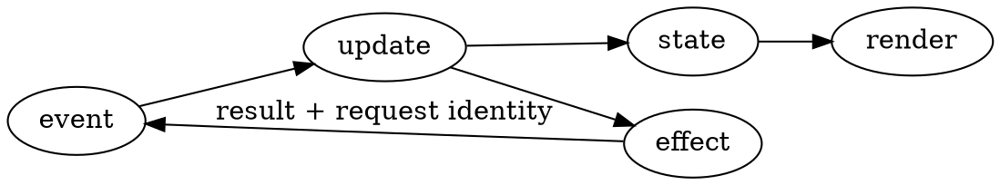

# TUI Design System

Design around the user's repeated action, the data they must keep in view, and the terminal capabilities actually available. A TUI in 2026 should feel like a first-class app: mouse-clickable, visually intentional, and responsive — while staying keyboard-complete and functional under slow I/O. Keep input responsive, and make selection, focus, hover, and operation state explicit.

**Primary documentation checked: 2026-09-04.** Framework APIs change; use the project's versions. Follow the project's visual identity (SilkCircuit Neon for Bliss's personal tools) rather than treating an example palette as a universal theme.

## Choose the Layout from the Work

| Work                                      | Layout                               | Useful invariant                                           |
| ------------------------------------------ | ------------------------------------- | ------------------------------------------------------------ |
| Browse related lists and details          | Persistent multi-panel               | Stable panel roles and visible focus                        |
| Navigate a hierarchy                      | Miller columns or drill-down stack   | Back restores selection and scroll position                 |
| Monitor changing measurements              | Widget dashboard                     | Labels, units, freshness, and a path to details              |
| Edit requests, queries, or configuration  | Sidebar, editor, results              | Keep editing state when switching panels                    |
| Select a value for a shell command        | Inline picker or overlay             | Return a clean value and preserve shell scrollback           |
| Read logs or events                       | Fixed controls plus virtualized list | Follow mode is explicit; scrolling back stops auto-follow    |

Read [app-patterns.md](references/app-patterns.md) for examples and tradeoffs. Read [visual-catalog.md](references/visual-catalog.md) when selecting glyphs, borders, charts, or indicators.

### Responsive Behavior

Use constraints and content priorities. Keep the selected item visible while collapsing secondary panels; preserve state when they reappear. Recompute layout on resize without treating a zero-sized transient area as an error. Clamp scrolling after filtering, deletion, or a smaller viewport.

Test narrow, ordinary, and wide layouts, including rapid resizing. The minimum usable size follows the task; 80x24 is a useful test case, not permission to disable a picker that would work in 40 columns. A size message should retain quit and recovery input.

## Make It Feel Modern and Clickable

Treat the mouse as a primary input, not a fallback for people who can't remember keybindings. Every action reachable by keyboard should also have an obvious click target, and every click target should look clickable before it's clicked.

| Concern                         | Decision                                                                                                    |
| -------------------------------- | ------------------------------------------------------------------------------------------------------------ |
| Click targets                   | Make rows, tabs, buttons, and list items whole-area clickable, not just a single character or icon           |
| Hover state                     | Reverse video, underline, or a subtle background tint on the cell under the cursor, distinct from selection |
| Press/active state               | A brief visual change on mouse-down (before release) confirms the click registered, not just the result      |
| Selection vs. hover              | Keep them visually distinct (e.g., accent-colored left border for selection, dim background for hover)      |
| Scroll wheel                     | Wire wheel events to list/viewport scrolling; don't require keyboard focus first                             |
| Click-to-focus panels            | Clicking anywhere in a panel moves focus there, matching Tab/arrow focus order                               |
| Drag-resize                     | If panes are resizable, support drag on the border; show a resize cursor/highlight on hover over the border  |
| Double-click                     | Reserve for "open/drill into", matching Enter; don't overload it with a second unrelated action              |
| Right-click                     | Optional context menu mirroring the keyboard shortcut list for that item; never mouse-only functionality     |
| Buttons and tabs                 | Draw them with visible boundaries (not just colored text) so they read as interactive at a glance            |

Modern-looking does not mean decorative. Every visual affordance above should map to a real, testable interaction — a hover highlight that doesn't actually accept a click is worse than no highlight at all.

### Visual Polish That Still Reads as a Terminal App

- **Rounded panels**: prefer rounded box-drawing corners (`╭ ╮ ╰ ╯`) over square (`┌ ┐ └ ┘`) for a softer, more current look, when the framework and font support it; fall back to square corners automatically if not.
- **Accent, not noise**: pick one accent color for focus/selection/primary action, one muted tone for secondary text, and reserve saturated colors (red/yellow/green) for status only. Most panels should be low-contrast until something needs attention.
- **Depth without gradients**: true color lets you fake elevation with a slightly lighter/darker panel background and a one-cell dim border, rather than heavy borders everywhere. Use sparingly — depth cues compete with data if overused.
- **Generous internal padding**: one cell of padding inside panels and around single-line inputs reads as "designed" rather than "packed terminal output."
- **Icons are a garnish, not a crutch**: Nerd Font glyphs can label panel types or status at a glance, but every icon needs a text label or is discoverable via help — see the Nerd Font row in Terminal Capability Policy.
- **Study real examples**: modern terminal apps widely regarded as well-designed (lazygit, gitui, k9s, bottom/btm, yazi, superfile, gh dash) are good references for panel framing, focus color, and status-bar density. Match the level of polish, not the exact palette, unless the user names one of these as a reference.

## Input, Focus, and Editing

| Concern             | Decision                                                                                 |
| -------------------- | ------------------------------------------------------------------------------------------ |
| Basic navigation    | Support arrows, Enter, Escape, and discoverable focus movement                            |
| Mouse navigation    | Click, hover, wheel-scroll, and drag-resize all mirror the keyboard equivalents (see above) |
| Expert shortcuts    | Add vim motions or a command palette when they improve repeated work                       |
| Text fields         | Printable keys edit text; `q`, `j`, `/`, and mnemonic actions must not fire globally       |
| Multi-key shortcuts | Show pending context and resolve Escape/prefix ambiguity through the input library          |
| Modal dialog        | Route input only to the modal; restore the prior valid focus target when it closes         |
| Destructive action  | Show the exact target and consequence; choose confirmation proportional to reversibility    |
| Mouse capture       | Match keyboard actions and provide a way to disable capture for terminal text selection     |

Maintain one owner for input parsing. With Crossterm, do not mix `EventStream` with `read`/`poll`, or run competing readers. Handle key press, repeat, release, and mouse move/down/up/drag/scroll deliberately; one physical click must not activate twice, and a drag must not also fire a click at drag-end.

Enhanced keyboard protocols can distinguish keys that legacy terminals encode identically. Negotiate support and retain usable fallback bindings. Never assume Ctrl+I differs from Tab or Ctrl+M from Enter everywhere. Treat bracketed paste as a text event; pasted newlines must not accidentally submit destructive commands.

Raw mode can disable the terminal's normal signal handling. Implement Ctrl+C and suspend/resume deliberately through the framework; do not assume the OS will handle them unchanged. Restore terminal state before handing control to an editor, pager, shell, or suspended process, then reacquire it and redraw.

Show a short footer for currently available actions and a contextual help view; when mouse support is on, the footer or a corner hint should say so, since users can't assume it. Keep essential instructions visible while a task is running. Durable errors need a retrievable location; a disappearing toast cannot be the only record.

## State and Async Work

Separate input events, state transitions, effects, and rendering. Render a snapshot of state without starting network calls or mutating the domain model from a drawing function.

| Failure mode                                          | Design response                                                                            |
| ------------------------------------------------------- | --------------------------------------------------------------------------------------------- |
| Search A completes after search B                     | Tag requests and discard results that no longer match the active query                     |
| A row moves after a refresh                           | Track selection by stable identity, not only a row index                                    |
| A view closes while work runs                         | Cancel owned work or detach it deliberately; late results must not resurrect the view       |
| A cancelled write may already have reached the server | Distinguish cancelled waiting from confirmed rollback; reconcile remote state               |
| Logs arrive faster than screen updates                | Retain required events in the data layer and render a virtualized viewport                  |
| Work blocks the UI despite `async` syntax             | Identify blocking calls or CPU work and move them off the input/render path                 |
| Repeated action would start duplicate writes          | Track pending operation identity and show its result before accepting a conflicting action  |
| Rapid clicks/double-clicks queue duplicate actions    | Debounce or track an in-flight operation id per click target, same as repeated key presses   |

Batch state updates and render changed frames. Coalesce replaceable visual snapshots, not audit events or mutations. Diagnose queue growth, indexing, and allocation costs before dropping data or capping concurrency.

## Terminal Capability Policy

Explicit application settings take precedence. In automatic mode, respect a non-empty `NO_COLOR` before color detection. A color override can opt back in deliberately; disabling color need not disable bold, underline, layout, or every terminal feature.

| Capability                    | Evidence and fallback                                                                                    |
| ------------------------------ | ------------------------------------------------------------------------------------------------------------ |
| Interactive terminal          | Check the actual input/output TTYs; support plain output or explain the need for a TTY                    |
| True color                    | Use the library's detection, terminfo, or negotiated support; `COLORTERM` is a hint, not a requirement    |
| 256/16 colors                 | Map semantic slots to supported colors and preserve labels and focus without hue                          |
| Mouse and SGR mouse mode      | Negotiate mouse reporting; fall back to keyboard-only cleanly if the terminal or multiplexer doesn't relay it |
| Images, hyperlinks, clipboard | Negotiate the protocol through multiplexers; provide a text or file alternative                           |
| Nerd Font icons               | Make them explicit or user-configurable; there is no portable reliable font-detection API                 |
| Unicode layout                | Segment graphemes and measure terminal cell width; do not use byte or code-point length                   |

Truncate only at grapheme boundaries, accounting for wide cells, combining marks, variation selectors, and emoji sequences. Width libraries and emulators can disagree; test representative user text and offer ASCII indicators where rendering is uncertain.

Treat filenames, logs, and remote strings as untrusted display data. Escape control sequences before writing them through raw output APIs; otherwise a displayed value can move the cursor, change a title, or invoke an OSC operation. Use the framework's supported text/sanitization path.

Terminal queries share the input stream with keystrokes. Let one parser correlate replies, limit waiting for unsupported queries, and choose a fallback without swallowing user input.

## Visual Hierarchy and Accessibility

Define semantic slots such as foreground, muted text, focus, hover, selection, warning, and error. Keep theme values out of widget code. Use stable spacing and labels before introducing more borders. Provide dark and light variants when the application sets its own background; transparent/default backgrounds need testing against the user's theme.

Pair status colors with text or shape. Use focus and hover indicators that survive monochrome mode, and avoid dimming important values until they become unreadable. WCAG's 4.5:1 normal-text contrast is a useful design target, but terminal font size and ANSI colors are user-controlled; a bold terminal heading does not automatically qualify for the large-text exception. Do not claim formal accessibility compliance from a palette alone.

Provide a plain or linear presentation when a full-screen interface defeats screen-reader navigation. Meaningful labels, keyboard access, and a non-animated mode still need testing with the intended terminal and assistive technology. Avoid blinking warnings or rapidly flashing status. Let users reduce motion; animation must not delay input or hide the final state.

## Rendering and Terminal Lifecycle

Use the framework's buffered rendering and cell diffing. Batch writes; use synchronized output only when supported and always pair begin/end even on errors. A single write is not proof of atomic rendering, and synchronized output is an enhancement rather than a prerequisite for a usable TUI.

Render on state changes, an active animation deadline, or a mouse-move/hover update. Measure input latency, output bandwidth, and redraw cost under the intended data rate, including SSH and multiplexers — hover highlighting that redraws on every mouse-move event is a common source of unnecessary full-frame redraws; diff and only repaint the affected cells.

Acquire terminal modes through a scoped owner and restore everything the app enabled: raw mode, alternate screen, cursor visibility, mouse capture, bracketed paste, and keyboard protocol state. Cover normal exit, initialization failure, exceptions/panics, and handled signals. A framework restoration helper may cover only a subset; check its contract. SIGKILL cannot run cleanup.

## Verification That Changes Confidence

Use deterministic state-transition tests for selection after deletion, stale async results, modal focus restoration, and cancelled operations. Use the framework's test backend for layout boundaries; inspect at least one real PTY session because snapshots do not exercise terminal modes or input protocols.

Exercise launch, typing, paste, resize, modal open/close, slow or failed I/O, mouse click/hover/drag/scroll on every interactive element, and exit. Include light/dark themes, color disabled, mouse disabled/unsupported, wide/combining text, and the actual supported terminal/multiplexer path. After exit, verify the shell cursor and echo behavior are restored. Expand the matrix when a portability requirement or failure justifies it.

## Anti-Patterns

| Anti-Pattern                                          | Better action                                                    |
| -------------------------------------------------------- | -------------------------------------------------------------------- |
| `NO_COLOR` checked after true-color detection         | Resolve user preference before capability selection               |
| Global mnemonic shortcuts consume text input          | Route events through focus and active mode                        |
| Unicode release cutoff presented as compatibility     | Measure graphemes/cells and test supported emulators               |
| Async request completion overwrites newer state       | Correlate result identity with current view/query                 |
| Screen clears or escape codes from background logging | Send logs through state or a separate sink                        |
| Lower FPS or concurrency hides an overloaded queue    | Profile the producer, state processing, and renderer separately    |
| Only normal exit restores the terminal                | Use lifecycle guards and framework panic/signal handling           |
| Mouse support bolted on as click-anywhere-to-select   | Design hover, press, focus, and selection as distinct visual states |
| Colored text alone signals "this is clickable"        | Give click targets a visible boundary or background, not just hue  |
| Decorative icons/gradients added to a working picker  | Polish should map to a real interaction; skip it if it doesn't      |

## Primary Sources

Checked 2026-09-04: [Ratatui application patterns](https://ratatui.rs/concepts/application-patterns/), [Ratatui restoration contract](https://docs.rs/ratatui/latest/ratatui/fn.restore.html), [Crossterm input ownership](https://docs.rs/crossterm/latest/crossterm/event/index.html), [kitty keyboard protocol](https://sw.kovidgoyal.net/kitty/keyboard-protocol/), [NO_COLOR](https://no-color.org/), [Unicode grapheme segmentation](https://unicode.org/reports/tr29/), and [contrast guidance](https://www.w3.org/WAI/WCAG22/Understanding/contrast-minimum.html).

The state-ownership, verification, and mouse-interaction guidance is engineering synthesis from these contracts and observed practice in widely-used modern TUIs, not a claim that any protocol guarantees application correctness.

## What This Skill is NOT

- Not a framework API manual or a mandate to adopt a new toolkit.
- Not a reason to add animation, icons, or decorative gradients where they don't map to a real interaction.
- Not a mandate to make every element mouse-only; keyboard parity is always required.
- Not a substitute for testing the actual terminal, mouse protocol, and accessibility path.
