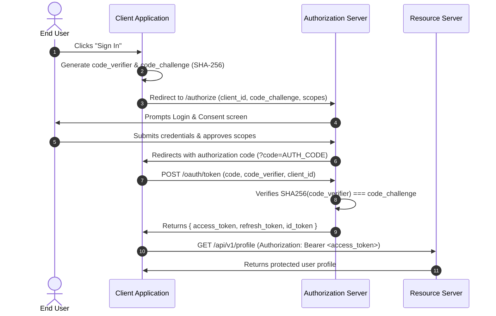
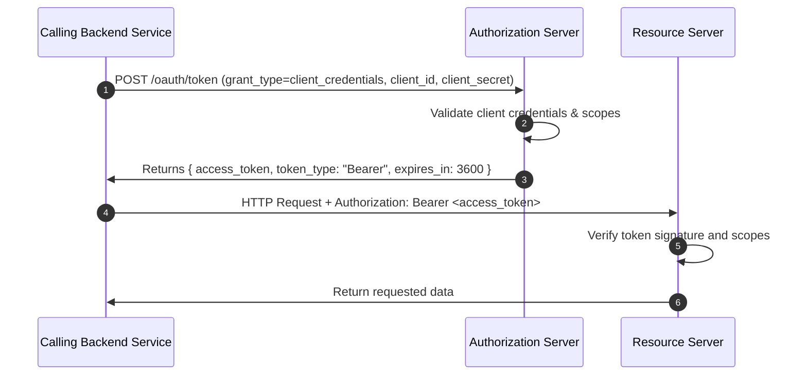

# REST and GraphQL Architecture & Implementation Patterns

This reference document provides production-grade architectural patterns, concrete implementations, and code examples for modern API engineering. All patterns are runtime-tested, framework-adaptable, and project-agnostic.

---

## Table of Contents

1. [RESTful Endpoint Design Patterns](#1-restful-endpoint-design-patterns)
2. [JWT Implementation Patterns](#2-jwt-implementation-patterns)
3. [OAuth 2.0 Flow Diagrams and Code](#3-oauth-20-flow-diagrams-and-code)
4. [GraphQL Schema Design Patterns](#4-graphql-schema-design-patterns)
5. [RFC 7807 Error Response Format Examples](#5-rfc-7807-error-response-format-examples)
6. [Pagination Implementation Examples](#6-pagination-implementation-examples)
7. [Rate Limiter Patterns](#7-rate-limiter-patterns)

---

## 1. RESTful Endpoint Design Patterns

### 1.1 Resource CRUD and Sub-Resource Relationships

A production RESTful design organizes entities around resources, hierarchical relationships, and collection queries.

```text
GET    /api/v1/projects                  # List projects (paginated, filtered)
POST   /api/v1/projects                  # Create a project
GET    /api/v1/projects/{projectId}      # Retrieve project details
PUT    /api/v1/projects/{projectId}      # Full replacement of project
PATCH  /api/v1/projects/{projectId}      # Partial update of project attributes
DELETE /api/v1/projects/{projectId}      # Delete project

GET    /api/v1/projects/{projectId}/tasks       # List tasks under a project
POST   /api/v1/projects/{projectId}/tasks       # Create task within project
GET    /api/v1/tasks/{taskId}                   # Access task directly (flattened)
PATCH  /api/v1/tasks/{taskId}                   # Update task directly
```

### 1.2 State Transitions and RPC-Style Actions

When an action does not map cleanly to standard CRUD operations (e.g., publishing, approving, archiving), model the action as a sub-resource or state transition controller:

```text
POST /api/v1/projects/{projectId}/archive       # Trigger state machine transition
POST /api/v1/invoices/{invoiceId}/reissue        # Reissue an existing invoice
POST /api/v1/accounts/{accountId}/verification   # Submit account for verification
```

### 1.3 Asynchronous Job Processing Pattern (`202 Accepted`)

For heavy computations, batch exports, or external integrations exceeding acceptable request timeouts (>500ms):

#### Step 1: Client submits request
```http
POST /api/v1/reports/exports HTTP/1.1
Host: api.example.com
Content-Type: application/json

{
  "dateFrom": "2026-01-01",
  "dateTo": "2026-09-30",
  "format": "csv"
}
```

#### Step 2: Server responds with 202 Accepted and job tracking URI
```http
HTTP/1.1 202 Accepted
Location: /api/v1/jobs/job_99ab81c7
Content-Type: application/json

{
  "data": {
    "jobId": "job_99ab81c7",
    "status": "queued",
    "estimatedCompletionSeconds": 15,
    "checkStatusUrl": "/api/v1/jobs/job_99ab81c7"
  }
}
```

#### Step 3: Client polls job status
```http
GET /api/v1/jobs/job_99ab81c7 HTTP/1.1
Host: api.example.com

HTTP/1.1 200 OK
Content-Type: application/json

{
  "data": {
    "jobId": "job_99ab81c7",
    "status": "completed",
    "resultUrl": "/api/v1/reports/downloads/rep_8819ab23.csv"
  }
}
```

### 1.4 Idempotency Key Handling Pattern

Protects mutating operations (`POST`) against accidental duplicate submissions caused by network drops or client retries.

```typescript
import { Request, Response, NextFunction } from 'express';
import Redis from 'ioredis';

const redis = new Redis(process.env.REDIS_URL || 'redis://localhost:6379');

export function idempotencyMiddleware(ttlSeconds = 86400) {
  return async (req: Request, res: Response, next: NextFunction): Promise<void> => {
    // Only enforce on mutating requests
    if (!['POST', 'PATCH'].includes(req.method)) {
      return next();
    }

    const idempotencyKey = req.headers['idempotency-key'] as string;
    if (!idempotencyKey) {
      return next();
    }

    const cacheKey = `idempotency:${req.ip}:${idempotencyKey}`;
    const cachedResponse = await redis.get(cacheKey);

    if (cachedResponse) {
      const parsed = JSON.parse(cachedResponse);
      if (parsed.status === 'in_progress') {
        res.status(409).json({
          type: 'https://api.example.com/errors/concurrent-request',
          title: 'Request In Progress',
          status: 409,
          detail: 'A request with this idempotency key is currently executing.',
        });
        return;
      }

      // Replay stored response
      res.setHeader('X-Cache-Lookup', 'HIT-IDEMPOTENCY');
      res.status(parsed.statusCode).json(parsed.body);
      return;
    }

    // Set lock
    await redis.set(cacheKey, JSON.stringify({ status: 'in_progress' }), 'EX', 60);

    // Capture response
    const originalJson = res.json.bind(res);
    res.json = (body: any) => {
      if (res.statusCode >= 200 && res.statusCode < 300) {
        redis.set(
          cacheKey,
          JSON.stringify({ statusCode: res.statusCode, body }),
          'EX',
          ttlSeconds
        );
      } else {
        redis.del(cacheKey); // Clear lock on client/server errors
      }
      return originalJson(body);
    };

    next();
  };
}
```

---

## 2. JWT Implementation Patterns

### 2.1 Asymmetric Token Signing Architecture

For production architectures, sign JWTs using asymmetric cryptography (e.g., RS256 or Ed25519) rather than symmetric HS256:
- **Private Key**: Kept exclusively on the Auth / Token Issuance service.
- **Public Key**: Distributed to API gateways and microservices for verification without needing secrets.

```
+-------------------+        Signs JWT (RS256)        +-------------------+
|   Auth Service    |  ===========================>   | Client / Consumer |
| (Owns Private Key)|                                 +-------------------+
+-------------------+                                           |
                                                      Transmits Bearer Token
                                                                v
+-------------------+       Verifies Signature        +-------------------+
|   Resource API    |  <===========================   |    API Gateway    |
| (Owns Public Key) |                                 +-------------------+
+-------------------+
```

### 2.2 Token Issuance and Verification (TypeScript / `jsonwebtoken`)

```typescript
import jwt, { SignOptions, VerifyOptions } from 'jsonwebtoken';
import crypto from 'crypto';

export interface TokenPayload {
  sub: string;       // Subject (User ID)
  email: string;
  role: string;
  permissions: string[];
  jti: string;       // JWT ID (unique per token)
  iss: string;       // Issuer
  aud: string;       // Audience
}

export class TokenService {
  constructor(
    private privateKey: string,
    private publicKey: string,
    private issuer = 'https://auth.example.com',
    private audience = 'https://api.example.com'
  ) {}

  generateAccessToken(user: { id: string; email: string; role: string; permissions: string[] }): string {
    const payload: TokenPayload = {
      sub: user.id,
      email: user.email,
      role: user.role,
      permissions: user.permissions,
      jti: crypto.randomUUID(),
      iss: this.issuer,
      aud: this.audience,
    };

    const options: SignOptions = {
      algorithm: 'RS256',
      expiresIn: '15m', // Short TTL for access tokens
    };

    return jwt.sign(payload, this.privateKey, options);
  }

  verifyAccessToken(token: string): TokenPayload {
    const options: VerifyOptions = {
      algorithms: ['RS256'],
      issuer: this.issuer,
      audience: this.audience,
    };

    return jwt.verify(token, this.publicKey, options) as TokenPayload;
  }
}
```

### 2.3 Refresh Token Rotation with Reuse Detection

Refresh tokens must rotate on every use. If a previously used refresh token is presented, invalidate the entire token family (compromise indicator).

```typescript
import Redis from 'ioredis';
import crypto from 'crypto';

export class RefreshTokenManager {
  constructor(private redis: Redis) {}

  /**
   * Generates a new refresh token bound to a family.
   */
  async createRefreshToken(userId: string, familyId?: string): Promise<{ token: string; familyId: string }> {
    const token = crypto.randomBytes(40).toString('hex');
    const family = familyId || crypto.randomUUID();

    const data = {
      userId,
      familyId: family,
      isUsed: false,
    };

    // Store token state with 14 days expiration
    await this.redis.set(`rt:${token}`, JSON.stringify(data), 'EX', 14 * 86400);

    return { token, familyId: family };
  }

  /**
   * Exchanges an existing refresh token for a new pair.
   */
  async rotateRefreshToken(oldToken: string): Promise<{ userId: string; newRefreshToken: string }> {
    const key = `rt:${oldToken}`;
    const rawData = await this.redis.get(key);

    if (!rawData) {
      throw new Error('Invalid or expired refresh token');
    }

    const tokenData = JSON.parse(rawData);

    // Reuse detection: Token was already consumed!
    if (tokenData.isUsed) {
      // Invalidate all tokens associated with this user/family
      await this.redis.del(`family:${tokenData.familyId}`);
      throw new Error('Refresh token reuse detected. Access revoked.');
    }

    // Mark current token as consumed
    tokenData.isUsed = true;
    await this.redis.set(key, JSON.stringify(tokenData), 'EX', 3600); // Retain briefly for grace periods

    // Issue new token in same family
    const next = await this.createRefreshToken(tokenData.userId, tokenData.familyId);

    return {
      userId: tokenData.userId,
      newRefreshToken: next.token,
    };
  }
}
```

---

## 3. OAuth 2.0 Flow Diagrams and Code

### 3.1 Authorization Code Flow with PKCE (Proof Key for Public Clients)

Modern standard for single-page applications (SPA), native mobile apps, and confidential web apps.



#### PKCE Code Challenge Generator (TypeScript)
```typescript
import crypto from 'crypto';

export function generatePKCEPair(): { verifier: string; challenge: string } {
  // Generate random 43-128 character base64url string
  const verifier = crypto.randomBytes(32).toString('base64url');

  // Compute SHA-256 hash and encode as base64url
  const challenge = crypto
    .createHash('sha256')
    .update(verifier)
    .digest('base64url');

  return { verifier, challenge };
}
```

### 3.2 Client Credentials Flow (Machine-to-Machine)

Used when services communicate directly without user context.



#### Client Credentials Token Exchange Endpoint Handler
```typescript
import { Request, Response } from 'express';

export async function handleTokenExchange(req: Request, res: Response): Promise<void> {
  const { grant_type, client_id, client_secret, scope } = req.body;

  if (grant_type !== 'client_credentials') {
    res.status(400).json({
      error: 'unsupported_grant_type',
      error_description: 'Only client_credentials grant type is supported on this endpoint.',
    });
    return;
  }

  // Validate credentials against secure store
  const client = await authenticateClient(client_id, client_secret);
  if (!client) {
    res.status(401).json({
      error: 'invalid_client',
      error_description: 'Client authentication failed.',
    });
    return;
  }

  const requestedScopes = scope ? scope.split(' ') : [];
  const grantedScopes = requestedScopes.filter((s: string) => client.allowedScopes.includes(s));

  const accessToken = generateM2MToken({
    sub: client.id,
    scopes: grantedScopes,
  });

  res.setHeader('Cache-Control', 'no-store');
  res.setHeader('Pragma', 'no-cache');
  res.status(200).json({
    access_token: accessToken,
    token_type: 'Bearer',
    expires_in: 3600,
    scope: grantedScopes.join(' '),
  });
}

async function authenticateClient(id: string, secret: string): Promise<any> {
  // Constant-time check in production
  return id && secret ? { id, allowedScopes: ['read:data', 'write:data'] } : null;
}

function generateM2MToken(payload: object): string {
  return 'eyJhbGciOiJSUzI1NiIsInR5cCI6IkpXVCJ9...';
}
```

---

## 4. GraphQL Schema Design Patterns

### 4.1 Production Schema Definition Language (SDL) with Relay Cursor Connections

```graphql
"""
Common interfaces and scalar types
"""
scalar DateTime

interface Node {
  id: ID!
}

type PageInfo {
  hasNextPage: Boolean!
  hasPreviousPage: Boolean!
  startCursor: String
  endCursor: String
}

"""
Resource Entities
"""
type User implements Node {
  id: ID!
  email: String!
  displayName: String!
  createdAt: DateTime!
  organizations(first: Int, after: String): OrganizationConnection!
}

type Organization implements Node {
  id: ID!
  name: String!
  slug: String!
  members(first: Int, after: String): UserConnection!
}

"""
Relay Connection Types
"""
type UserConnection {
  edges: [UserEdge!]!
  pageInfo: PageInfo!
  totalCount: Int!
}

type UserEdge {
  cursor: String!
  node: User!
}

type OrganizationConnection {
  edges: [OrganizationEdge!]!
  pageInfo: PageInfo!
  totalCount: Int!
}

type OrganizationEdge {
  cursor: String!
  node: Organization!
}

"""
Root Operations
"""
type Query {
  node(id: ID!): Node
  me: User!
  organization(id: ID!): Organization
}

type Mutation {
  createOrganization(input: CreateOrganizationInput!): CreateOrganizationPayload!
  updateUser(input: UpdateUserInput!): UpdateUserPayload!
}

input CreateOrganizationInput {
  name: String!
  slug: String!
  clientMutationId: String
}

type CreateOrganizationPayload {
  organization: Organization
  clientMutationId: String
  userErrors: [UserError!]!
}

type UserError {
  field: [String!]!
  message: String!
  code: String!
}
```

### 4.2 Resolving N+1 Queries with DataLoader

```typescript
import DataLoader from 'dataloader';

interface UserRecord {
  id: string;
  name: string;
  orgId: string;
}

// Simulated database batch query
async function batchGetUsersByOrgIds(orgIds: readonly string[]): Promise<UserRecord[][]> {
  // SELECT * FROM users WHERE org_id IN (...)
  const allUsers: UserRecord[] = await db.query(
    'SELECT id, name, org_id FROM users WHERE org_id = ANY($1)',
    [orgIds]
  );

  // Group users by orgId
  const map = new Map<string, UserRecord[]>();
  for (const orgId of orgIds) {
    map.set(orgId, []);
  }
  for (const user of allUsers) {
    map.get(user.orgId)?.push(user);
  }

  // Preserve index order matching input orgIds
  return orgIds.map((id) => map.get(id) || []);
}

export function createOrganizationMembersLoader() {
  return new DataLoader<string, UserRecord[]>((orgIds) => batchGetUsersByOrgIds(orgIds));
}

// In GraphQL Resolver
export const resolvers = {
  Organization: {
    members: async (parent: { id: string }, args: any, context: { loaders: { orgMembers: DataLoader<string, UserRecord[]> } }) => {
      const users = await context.loaders.orgMembers.load(parent.id);
      return {
        totalCount: users.length,
        edges: users.map((u) => ({
          cursor: Buffer.from(u.id).toString('base64'),
          node: u,
        })),
        pageInfo: {
          hasNextPage: false,
          hasPreviousPage: false,
        },
      };
    },
  },
};
```

---

## 5. RFC 7807 Error Response Format Examples

All error responses use the `application/problem+json` media type.

### 5.1 400 Bad Request (Malformed JSON)
```http
HTTP/1.1 400 Bad Request
Content-Type: application/problem+json

{
  "type": "https://api.example.com/errors/invalid-json",
  "title": "Invalid JSON Syntax",
  "status": 400,
  "detail": "Unexpected token '}' at line 3, column 12.",
  "instance": "/api/v1/orders"
}
```

### 5.2 401 Unauthorized (Missing or Invalid Token)
```http
HTTP/1.1 401 Unauthorized
WWW-Authenticate: Bearer error="invalid_token", error_description="The token has expired"
Content-Type: application/problem+json

{
  "type": "https://api.example.com/errors/token-expired",
  "title": "Token Expired",
  "status": 401,
  "detail": "The provided access token expired at 2026-10-06T00:00:00Z.",
  "instance": "/api/v1/profile"
}
```

### 5.3 403 Forbidden (Insufficient Scope or Role)
```http
HTTP/1.1 403 Forbidden
Content-Type: application/problem+json

{
  "type": "https://api.example.com/errors/insufficient-permissions",
  "title": "Forbidden",
  "status": 403,
  "detail": "Your role 'member' does not have permission to delete resources in organization 'org_123'.",
  "instance": "/api/v1/organizations/org_123/projects/prj_456"
}
```

### 5.4 404 Not Found
```http
HTTP/1.1 404 Not Found
Content-Type: application/problem+json

{
  "type": "https://api.example.com/errors/resource-not-found",
  "title": "Resource Not Found",
  "status": 404,
  "detail": "No customer found matching identifier 'cus_unknown'.",
  "instance": "/api/v1/customers/cus_unknown"
}
```

### 5.5 409 Conflict (Duplicate Unique Constraint)
```http
HTTP/1.1 409 Conflict
Content-Type: application/problem+json

{
  "type": "https://api.example.com/errors/duplicate-resource",
  "title": "Conflict",
  "status": 409,
  "detail": "An account with email 'alex@example.com' already exists.",
  "instance": "/api/v1/users"
}
```

### 5.6 412 Precondition Failed (Optimistic Concurrency ETag Mismatch)
```http
HTTP/1.1 412 Precondition Failed
Content-Type: application/problem+json

{
  "type": "https://api.example.com/errors/precondition-failed",
  "title": "Precondition Failed",
  "status": 412,
  "detail": "The resource version provided in the 'If-Match' header does not match current state. Fetch the latest version before modifying.",
  "instance": "/api/v1/documents/doc_8820"
}
```

### 5.7 422 Unprocessable Entity (Multi-Field Validation Failure)
```http
HTTP/1.1 422 Unprocessable Entity
Content-Type: application/problem+json

{
  "type": "https://api.example.com/errors/validation-error",
  "title": "Validation Failed",
  "status": 422,
  "detail": "The request body failed 2 schema validation checks.",
  "instance": "/api/v1/subscriptions",
  "invalidParams": [
    {
      "name": "billingCycle",
      "reason": "Must be one of ['monthly', 'annual']."
    },
    {
      "name": "paymentMethodId",
      "reason": "Referenced payment method has expired or is invalid."
    }
  ]
}
```

### 5.8 429 Too Many Requests (Rate Limit Exceeded)
```http
HTTP/1.1 429 Too Many Requests
RateLimit-Limit: 100
RateLimit-Remaining: 0
RateLimit-Reset: 1728173400
Retry-After: 45
Content-Type: application/problem+json

{
  "type": "https://api.example.com/errors/rate-limit-exceeded",
  "title": "Too Many Requests",
  "status": 429,
  "detail": "API rate limit of 100 requests per minute exceeded. Retry after 45 seconds.",
  "instance": "/api/v1/search"
}
```

### 5.9 500 Internal Server Error (Sanitized Production Error)
```http
HTTP/1.1 500 Internal Server Error
Content-Type: application/problem+json

{
  "type": "https://api.example.com/errors/internal-server-error",
  "title": "Internal Server Error",
  "status": 500,
  "detail": "An unexpected error occurred. Request ID: req_981a2e.",
  "instance": "/api/v1/checkout"
}
```

---

## 6. Pagination Implementation Examples

### 6.1 Keyset / Cursor-Based Pagination (SQL Query & TypeScript)

Keyset pagination avoids slow offset scans by using stable, indexed composite keys `(created_at, id)`.

#### SQL Query Pattern
```sql
-- Forward pagination: fetch next 20 rows after a given cursor
SELECT id, title, created_at
FROM articles
WHERE (created_at < $1) OR (created_at = $1 AND id < $2)
ORDER BY created_at DESC, id DESC
LIMIT 21; -- Query limit + 1 to check if hasMore is true
```

#### TypeScript Implementation
```typescript
interface Article {
  id: string;
  title: string;
  createdAt: Date;
}

interface CursorData {
  createdAt: string;
  id: string;
}

export function encodeCursor(data: CursorData): string {
  return Buffer.from(JSON.stringify(data)).toString('base64url');
}

export function decodeCursor(cursor: string): CursorData {
  try {
    const raw = Buffer.from(cursor, 'base64url').toString('utf8');
    return JSON.parse(raw);
  } catch {
    throw new Error('Malformed cursor token');
  }
}

export async function fetchArticlesPaginated(db: any, limit = 20, cursor?: string) {
  const boundedLimit = Math.min(Math.max(1, limit), 100);
  let query = `
    SELECT id, title, created_at
    FROM articles
  `;
  const params: any[] = [];

  if (cursor) {
    const decoded = decodeCursor(cursor);
    query += ` WHERE (created_at < $1) OR (created_at = $1 AND id < $2) `;
    params.push(decoded.createdAt, decoded.id);
  }

  query += ` ORDER BY created_at DESC, id DESC LIMIT $${params.length + 1}`;
  params.push(boundedLimit + 1);

  const rows: Article[] = await db.query(query, params);
  const hasMore = rows.length > boundedLimit;
  const items = hasMore ? rows.slice(0, boundedLimit) : rows;

  let nextCursor: string | null = null;
  if (hasMore && items.length > 0) {
    const lastItem = items[items.length - 1];
    nextCursor = encodeCursor({
      createdAt: lastItem.createdAt.toISOString(),
      id: lastItem.id,
    });
  }

  return {
    data: items,
    pagination: {
      limit: boundedLimit,
      hasMore,
      nextCursor,
    },
  };
}
```

---

## 7. Rate Limiter Patterns

### 7.1 Distributed Sliding Window Counter (Redis Lua Script)

Using an atomic Lua script guarantees that concurrent requests across multiple API nodes are evaluated without race conditions.

```lua
-- keys: [1] ratelimit_key
-- argv: [1] current_timestamp (milliseconds)
-- argv: [2] window_size (milliseconds)
-- argv: [3] max_limit

local key = KEYS[1]
local now = tonumber(ARGV[1])
local window = tonumber(ARGV[2])
local limit = tonumber(ARGV[3])
local clear_before = now - window

-- Remove entries outside current window
redis.call('ZREMRANGEBYSCORE', key, 0, clear_before)

-- Count entries within window
local current_requests = redis.call('ZCARD', key)

if current_requests < limit then
  -- Add new request entry with unique member
  redis.call('ZADD', key, now, now .. '-' .. redis.call('INCR', 'rl:seq'))
  redis.call('PEXPIRE', key, window)
  return { 1, limit - current_requests - 1 } -- [1: allowed (true), 2: remaining]
else
  return { 0, 0 } -- [1: allowed (false), 2: remaining]
end
```

### 7.2 Integration Middleware (Node.js / Express)

```typescript
import { Request, Response, NextFunction } from 'express';
import Redis from 'ioredis';

const redis = new Redis(process.env.REDIS_URL || 'redis://localhost:6379');

const SLIDING_WINDOW_LUA = `
local key = KEYS[1]
local now = tonumber(ARGV[1])
local window = tonumber(ARGV[2])
local limit = tonumber(ARGV[3])
local clear_before = now - window

redis.call('ZREMRANGEBYSCORE', key, 0, clear_before)
local current_requests = redis.call('ZCARD', key)

if current_requests < limit then
  redis.call('ZADD', key, now, now .. '-' .. redis.call('INCR', 'rl:seq'))
  redis.call('PEXPIRE', key, window)
  return { 1, limit - current_requests - 1 }
else
  return { 0, 0 }
end
`;

redis.defineCommand('slidingRateLimit', {
  numberOfKeys: 1,
  lua: SLIDING_WINDOW_LUA,
});

declare module 'ioredis' {
  interface Redis {
    slidingRateLimit(key: string, now: number, windowMs: number, maxLimit: number): Promise<[number, number]>;
  }
}

export function createDistributedRateLimiter(options: { windowMs: number; maxLimit: number }) {
  return async (req: Request, res: Response, next: NextFunction): Promise<void> => {
    // Partition limit by client IP or authenticated API key/User ID
    const identifier = (req.headers['authorization'] as string) || req.ip;
    const redisKey = `rl:${identifier}:${req.baseUrl}${req.path}`;
    const now = Date.now();

    try {
      const [allowed, remaining] = await redis.slidingRateLimit(
        redisKey,
        now,
        options.windowMs,
        options.maxLimit
      );

      const resetTime = Math.ceil((now + options.windowMs) / 1000);
      res.setHeader('RateLimit-Limit', options.maxLimit);
      res.setHeader('RateLimit-Remaining', remaining);
      res.setHeader('RateLimit-Reset', resetTime);

      if (allowed === 0) {
        const retryAfterSec = Math.ceil(options.windowMs / 1000);
        res.setHeader('Retry-After', retryAfterSec);
        res.status(429).json({
          type: 'https://api.example.com/errors/rate-limit-exceeded',
          title: 'Too Many Requests',
          status: 429,
          detail: `Rate limit quota of ${options.maxLimit} requests per ${options.windowMs / 1000}s exceeded.`,
        });
        return;
      }

      next();
    } catch (err) {
      // Fail open if Redis is down to preserve availability, but log alert
      console.error('Rate limiter failure (failing open):', err);
      next();
    }
  };
}
```

---

### 7.3 Token Bucket In-Memory Implementation

For lightweight, non-distributed services or edge functions:

```typescript
export class TokenBucket {
  private tokens: number;
  private lastRefillTimestamp: number;

  constructor(
    private capacity: number,       // Maximum tokens bucket can hold
    private refillRatePerSecond: number // Tokens added per second
  ) {
    this.tokens = capacity;
    this.lastRefillTimestamp = Date.now();
  }

  private refill(): void {
    const now = Date.now();
    const elapsedSeconds = (now - this.lastRefillTimestamp) / 1000;
    const tokensToAdd = elapsedSeconds * this.refillRatePerSecond;

    this.tokens = Math.min(this.capacity, this.tokens + tokensToAdd);
    this.lastRefillTimestamp = now;
  }

  consume(tokens = 1): boolean {
    this.refill();

    if (this.tokens >= tokens) {
      this.tokens -= tokens;
      return true;
    }

    return false;
  }
}
```
