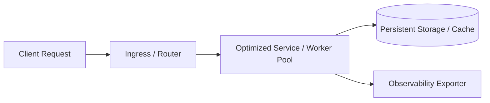
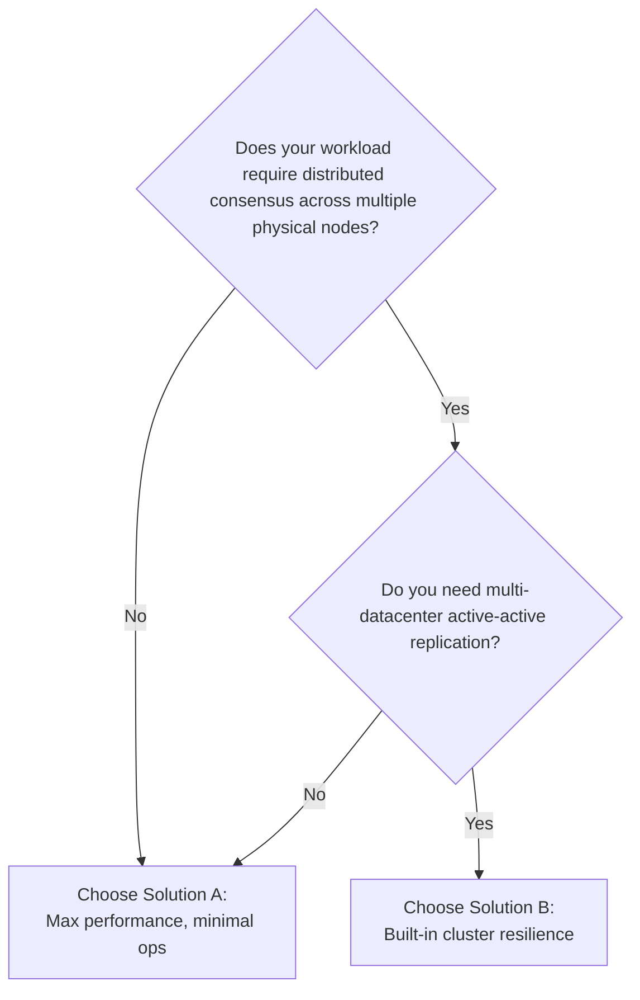
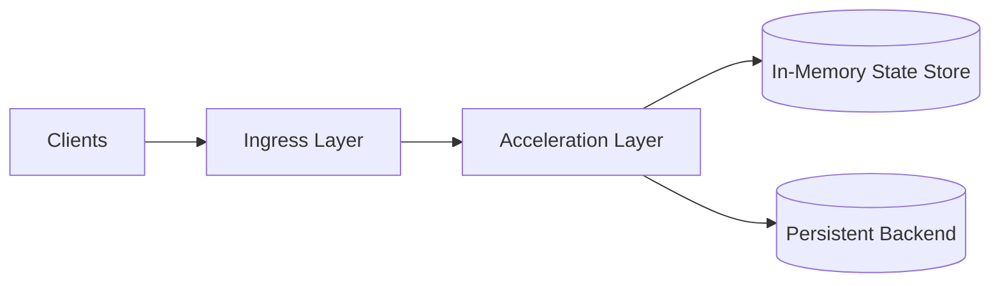

# Content Marketing Strategies & Operational Reference

This reference document provides production-ready templates, frameworks, launch runbooks, and analytics schemas for technical and developer-focused content marketing.

---

## Table of Contents

1. [Blog Post Templates](#1-blog-post-templates)
   - [Template A: Technical How-To / Deep-Dive](#template-a-technical-how-to--deep-dive)
   - [Template B: Curated / Listicle Guide](#template-b-curated--listicle-guide)
   - [Template C: Head-to-Head Comparison Guide](#template-c-head-to-head-comparison-guide)
   - [Template D: Architecture / Customer Case Study](#template-d-architecture--customer-case-study)
2. [Social Media Post Templates per Platform](#2-social-media-post-templates-per-platform)
   - [Twitter / X Post & Thread Templates](#twitter--x-post--thread-templates)
   - [LinkedIn Post Templates](#linkedin-post-templates)
   - [Reddit Community Self-Post Template](#reddit-community-self-post-template)
   - [Product Hunt Launch Collateral](#product-hunt-launch-collateral)
   - [Hacker News (Show HN) Submission Template](#hacker-news-show-hn-submission-template)
3. [Email Sequence Templates](#3-email-sequence-templates)
   - [Welcome & Value Delivery Sequence](#welcome--value-delivery-sequence)
   - [Developer Onboarding & Activation Sequence](#developer-onboarding--activation-sequence)
   - [Re-engagement & Win-Back Sequence](#re-engagement--win-back-sequence)
   - [Release / Changelog Newsletter Template](#release--changelog-newsletter-template)
4. [Launch Checklist for Open Source Projects](#4-launch-checklist-for-open-source-projects)
   - [Pre-Launch Phase (T-14 Days to T-1 Day)](#pre-launch-phase-t-14-days-to-t-1-day)
   - [Launch Day Hour-by-Hour Runbook](#launch-day-hour-by-hour-runbook)
   - [Post-Launch Momentum (T+24 Hours to T+7 Days)](#post-launch-momentum-t24-hours-to-t7-days)
5. [Content Audit Framework](#5-content-audit-framework)
   - [Content Audit Inventory Schema](#content-audit-inventory-schema)
   - [Audit Decision Matrix (Action Rubric)](#audit-decision-matrix-action-rubric)
   - [Content Health Check CLI Script](#content-health-check-cli-script)
6. [Analytics Dashboard Setup Guide](#6-analytics-dashboard-setup-guide)
   - [Event Instrumentation & Tracking Schema](#event-instrumentation--tracking-schema)
   - [UTM Parameter Builder & Standards](#utm-parameter-builder--standards)
   - [Core Content Dashboard Specifications](#core-content-dashboard-specifications)

---

## 1. Blog Post Templates

### Template A: Technical How-To / Deep-Dive

```markdown
---
title: "How to <Achieve Desired Outcome> with <Technology/Tool>: Step-by-Step Guide"
description: "Learn how to <achieve outcome> using <technology>. Complete with code snippets, architecture breakdown, and benchmark results."
slug: "how-to-<achieve-outcome>-with-<technology>"
publishDate: "YYYY-MM-DD"
tags: ["<tag1>", "<tag2>", "<tag3>"]
canonicalUrl: "https://example.com/blog/how-to-<achieve-outcome>-with-<technology>"
---

# How to <Achieve Desired Outcome> with <Technology>

<The Friction: Describe the real-world operational pain point, failure mode, or latency issue that developers encounter when building this system.>

<The Stakes: Why traditional approaches, default configurations, or naive workarounds fail at scale or introduce maintenance debt.>

<The Solution: State clearly what this guide covers: the architecture, a working implementation, and reproduction steps.>

---

## The Core Challenge: Why <Problem Occurs>

<Explain the root cause of the issue using diagrams or concise explanations. Highlight the bottleneck, race condition, or architectural mismatch.>

```text
[Client Request] ──> [Bottleneck Component] ──X (Fails under high load: Error 504)
                            │
                            └── [Resource Exhaustion / Lock Contention]
```

### Key Technical Bottlenecks
- **Constraint 1:** <e.g., Thread pool exhaustion under concurrent connections>
- **Constraint 2:** <e.g., Inefficient serialization overhead across network hops>
- **Constraint 3:** <e.g., Unindexed database scans triggering full table locks>

---

## Architecture Overview

<Describe the target architecture and how the proposed pattern solves the bottleneck.>



---

## Step-by-Step Implementation

### Step 1: <Setup and Prerequisites>
<State prerequisites clearly: language versions, required packages, and environment configurations.>

```bash
# Clone the minimal reproduction repo or initialize project
mkdir -p <project-dir> && cd <project-dir>
<package-manager> install <dependency-1> <dependency-2>
```

### Step 2: <Core Implementation Block>
<Walk through the primary logic. Highlight critical configuration lines using inline comments.>

```<language>
// Core implementation demonstrating the pattern
import { ... } from '<dependency>';

export async function handleOptimizedOperation(payload: RequestPayload): Promise<ResponseResult> {
  // 1. Validate payload and acquire bounded resource
  const token = await resourcePool.acquire({ timeoutMs: 250 });
  
  try {
    // 2. Execute idempotent operation with circuit-breaker protection
    return await executeWithRetry(() => {
      return performCriticalTask(payload);
    });
  } finally {
    // 3. Guarantee resource release
    resourcePool.release(token);
  }
}
```

### Step 3: <Resilience, Error Handling, and Edge Cases>
<Address graceful shutdown, timeouts, retries, backpressure, or memory limits.>

---

## Benchmark & Performance Verification

<Provide concrete metrics before and after implementing the pattern.>

| Metric | Baseline / Naive Approach | Optimized Architecture | Delta |
| :--- | :--- | :--- | :--- |
| **p50 Latency** | `142 ms` | `12 ms` | **-91.5%** |
| **p99 Latency** | `1,280 ms` | `48 ms` | **-96.2%** |
| **Throughput** | `850 req/sec` | `12,400 req/sec` | **+14.5x** |
| **Memory Footprint** | `840 MB (leaking)` | `112 MB (stable)` | **-86.6%** |

---

## Common Pitfalls & How to Avoid Them

- **Pitfall 1:** <Description of common mistake and how to diagnose it.>
- **Pitfall 2:** <Description of misconfiguration and the correct setting.>

---

## Conclusion & Next Steps

<Summary of key takeaways in 2–3 sentences.>

Clone the complete working code and benchmark harness:
- **Repository:** `https://github.com/example/<repo-name>`
- **Documentation:** `https://example.com/docs/<topic>`
```

---

### Template B: Curated / Listicle Guide

```markdown
---
title: "<Number> Best <Category Tools/Patterns> for <Target Audience> in <Current Year>"
description: "Discover the top <number> <category> tools, architectural trade-offs, and selection criteria for modern engineering teams."
slug: "best-<category>-tools-<year>"
publishDate: "YYYY-MM-DD"
tags: ["<category>", "developer-tools", "productivity"]
---

# <Number> Best <Category> for <Target Audience> in <Year>

<Intro: The changing landscape of the ecosystem, why legacy solutions are being replaced, and what modern requirements look like.>

## Evaluation Criteria: How We Evaluated These Solutions

To provide an objective assessment, we evaluated each tool against four non-negotiable criteria:
1. **Developer Experience (DX):** Setup speed, CLI ergonomics, documentation quality, and local debugging support.
2. **Performance & Scalability:** Throughput overhead, resource utilization, and operational stability under load.
3. **Ecosystem & Interoperability:** SDK coverage, plugin availability, and framework support.
4. **Maintenance & Community:** Release cadence, open source license terms, and active contributor community.

---

## Comparison Matrix

| Tool / Solution | Primary Strengths | Ideal Workload | License / Hosting |
| :--- | :--- | :--- | :--- |
| **<Tool 1>** | <Fastest setup, zero-config> | <Greenfield web applications> | Open Source (MIT) / Self-host |
| **<Tool 2>** | <Enterprise compliance, multi-region> | <Large distributed microservices> | Open Source (Apache 2.0) |
| **<Tool 3>** | <Low memory, bare-metal speed> | <Edge compute / IoT systems> | Proprietary / Cloud |

---

## 1. <Tool 1>: Best for <Specific Use Case>

### Why It's on This List
<2-3 sentences explaining the unique technical edge or architectural novelty.>

### Key Technical Capabilities
- **Capability 1:** <Description with technical specifics>
- **Capability 2:** <Description with technical specifics>

### Code Sample / Quickstart
```bash
<install-command-for-tool-1>
```

### Trade-offs & Limitations
- **Pros:** <Bullet 1>, <Bullet 2>
- **Cons:** <Bullet 1>, <Bullet 2>

---

## 2. <Tool 2>: Best for <Specific Use Case>

<!-- Repeat structure for each item -->

---

## Summary Recommendation: Which Should You Choose?

- Choose **<Tool 1>** if you prioritize rapid developer velocity and zero-config deployment.
- Choose **<Tool 2>** if you manage distributed clusters across regulated multi-tenant clouds.
- Choose **<Tool 3>** if bare-metal execution speed and binary size are your primary constraints.
```

---

### Template C: Head-to-Head Comparison Guide

```markdown
---
title: "<Solution A> vs. <Solution B>: In-Depth Architectural & Performance Comparison"
description: "A fair, technical comparison of <Solution A> and <Solution B>. Explore architecture, latency benchmarks, DX, and operational costs."
slug: "<solution-a>-vs-<solution-b>"
publishDate: "YYYY-MM-DD"
tags: ["comparison", "<solution-a>", "<solution-b>", "architecture"]
---

# <Solution A> vs. <Solution B>: The Architectural Teardown

<Intro: Introduce both technologies, their origins, and why developers frequently evaluate them together.>

## High-Level Summary: The Key Differences

If you only have 30 seconds, here is the fundamental philosophical distinction:
- **<Solution A>** is designed for <Philosophy A: e.g., simplicity, embedded execution, single-node vertical scale>.
- **<Solution B>** is designed for <Philosophy B: e.g., horizontal clustering, consensus-driven consistency, cloud-native scale>.

---

## Architectural Comparison

```text
+------------------------------+     +------------------------------+
|         <Solution A>         |     |         <Solution B>         |
+------------------------------+     +------------------------------+
| Architecture: Embedded/Local |     | Architecture: Client-Server  |
| Storage: Single-file WAL     |     | Storage: Distributed Raft    |
| Protocol: In-process C-ABI   |     | Protocol: gRPC / HTTP2       |
| Concurrency: Single-writer   |     | Concurrency: Multi-master    |
+------------------------------+     +------------------------------+
```

### Deep Dive: Internal Mechanics
- **How <Solution A> works under the hood:** <Explain execution path, locking, caching.>
- **How <Solution B> works under the hood:** <Explain execution path, networking, cluster coordinator.>

---

## Benchmark Methodology & Results

### Test Environment
- **Hardware:** 8 vCPU, 32GB RAM, NVMe SSD (Ubuntu 24.04 LTS)
- **Workload:** 10,000,000 operations (80% read / 20% write), 128 concurrent clients
- **Source Code:** Reproducible test harness available at `<github-link>`

### Results Summary
| Metric | <Solution A> | <Solution B> | Winner |
| :--- | :--- | :--- | :--- |
| **Write Throughput (ops/sec)** | `45,000` | `28,000` | **<Solution A>** |
| **Read Throughput (ops/sec)** | `180,000` | `110,000` | **<Solution A>** |
| **P99 Read Latency** | `0.45 ms` | `1.85 ms` | **<Solution A>** |
| **Fault Tolerance / Failover** | Manual replica promotion | Automated Raft election | **<Solution B>** |
| **Operational Overhead** | Near-zero (single binary) | Medium (cluster management) | **<Solution A>** |

---

## Developer Experience & Integration

### Configuration Comparison
#### Setting up <Solution A>:
```yaml
# configuration-a.yaml
server:
  mode: standalone
  cache_size_mb: 512
```

#### Setting up <Solution B>:
```yaml
# configuration-b.yaml
cluster:
  nodes: ["node1:9092", "node2:9092", "node3:9092"]
  replication_factor: 3
```

---

## Decision Matrix: When to Pick Which


```

---

### Template D: Architecture / Customer Case Study

```markdown
---
title: "How <Organization/Team> Scaled to <Metric> Using <Technology>"
description: "Case study: How <Organization> eliminated <pain point>, reduced infrastructure spend by <percentage>, and scaled to <metric>."
slug: "case-study-<organization>-<technology>"
publishDate: "YYYY-MM-DD"
tags: ["case-study", "scaling", "architecture"]
---

# How <Organization> Scaled to <Metric> with <Technology>

<Executive Summary: 3-sentence summary of the business impact: the starting state, the technical bottleneck, and the quantified outcome achieved.>

---

## At a Glance

- **Industry / Sector:** <e.g., Real-Time Financial Infrastructure>
- **Team Size:** <e.g., 14 Platform Engineers>
- **The Challenge:** <e.g., 504 timeouts during peak trading hours; $45k/mo cloud database bills>
- **The Result:** <e.g., 94% reduction in p99 latency, 60% cloud infrastructure cost reduction>

---

## The Starting Point & Bottleneck

<Detail the original architecture, business pressures, and why the legacy stack hit its limits.>

```text
[Incoming Peak Traffic: 25k req/s]
              │
              ▼
   [Monolithic App Servers]
              │
              ▼ (Exhausted DB Connections)
    [Primary Database Cluster] ──> CPU Saturation @ 98% ──> Cascading Timeouts
```

---

## Evaluating Alternatives

Before implementing <Technology>, the team evaluated three options:
1. **Vertical Scaling:** Increasing server instances (Cost: prohibitive; did not address lock contention).
2. **Re-architecting to Microservices:** Estimated timeline of 9 months (Deemed too slow to market).
3. **Deploying <Technology>:** Evaluated as a drop-in accelerator layer.

---

## The New Architecture

<Explain the rollout strategy, canary deployment, and how the new solution was introduced without downtime.>



---

## Business & Technical Results

- **Latency:** p99 dropped from `850ms` to `22ms`.
- **Infrastructure Footprint:** Reduced compute nodes from 64 to 12.
- **Cost Savings:** Reduced monthly cloud spend by $28,000.
- **Reliability:** Maintained 99.995% uptime across Black Friday peak load.

---

## Lessons Learned & Advice for Other Teams

1. **Lesson 1:** <e.g., Implement strict timeouts at the ingress proxy before enabling caching.>
2. **Lesson 2:** <e.g., Ensure WAL replication channels have dedicated network bandwidth.>
```

---

## 2. Social Media Post Templates per Platform

### Twitter / X Post & Thread Templates

#### 1. High-Engagement Technical Hook Thread (8-Part Structure)

```text
Tweet 1 (Hook + Visual):
We spent 3 weeks diagnosing why our service choked at 50,000 req/sec.

It wasn't CPU starvation.
It wasn't memory leaks.
It wasn't network bandwidth.

It was a 2-line default configuration in <Technology>.

Here is the architectural teardown and how to fix it: 🧵👇
[Attach: Latency drop benchmark graph]

Tweet 2 (The Setup / Friction):
Our architecture seemed standard:
- Go backend running on Kubernetes
- Connection pool configured to 50 max connections
- Postgres 16 on NVMe storage

Under 10k req/sec, everything purred at 4ms p99 latency.
At 50k req/sec, p99 exploded to 3,200ms.

Tweet 3 (The Misdiagnosis):
The default instinct was to throw hardware at it:
- Scaled pods from 10 to 40
- Bumped `max_connections` from 100 to 1,000

Result?
Performance actually got WORSE.
Context switching skyrocketed and Postgres spent 68% of its CPU time managing spinlocks.

Tweet 4 (The Root Cause):
Why? Because database connections are not free threads.

Each connection consumes:
- Memory buffer allocation
- OS process scheduling overhead
- Lock table contention

Formula for optimal pool sizing:
connections = ((Core_Count * 2) + Effective_Spindle_Count)

For an 8-core CPU, optimal connections is ~17. Not 1,000.

Tweet 5 (The Fix / Code Snippet):
We replaced client-level over-allocation with bounded connection queues and introduced <Solution/Pattern>:

```go
poolConfig.MaxConns = 20
poolConfig.MinConns = 5
poolConfig.MaxConnLifetime = 30 * time.Minute
poolConfig.HealthCheckPeriod = 1 * time.Minute
```

Tweet 6 (The Results):
The outcome after applying this change:
- p99 latency dropped from 3,200ms to 8ms
- CPU utilization decreased by 45%
- Cloud infrastructure cost dropped $3,200/mo

Tweet 7 (Summary Checklist):
Key takeaways for production backends:
1. Stop bumping max_connections arbitrarily
2. Pool size should reflect CPU cores, not client count
3. Queue requests in front of the pool rather than inside the DB engine
4. Measure spinlock contention, not just CPU usage

Tweet 8 (Outbound Link / CTA):
We open-sourced the benchmark harness and published the full 2,500-word postmortem with configuration files:

Read the full breakdown: https://example.com/blog/connection-pooling?utm_source=twitter&utm_medium=social&utm_campaign=thread_postmortem

If you found this useful, RT Tweet 1 to save another team an outage.
```

#### 2. Feature / Release Announcement Tweet

```text
Announcing <Project/Tool> v2.4 🚀

Sub-millisecond query caching is now 100% automated with zero code changes:

⚡ Automated WAL log introspection
⚡ 40% lower memory footprint via compact binary serialization
⚡ Native OpenTelemetry metrics integration

Try it in 30 seconds:
curl -fsSL https://example.com/install.sh | bash

Full release notes & benchmarks: https://example.com/changelog/v2-4?utm_source=twitter&utm_medium=social&utm_campaign=release_v2_4
```

---

### LinkedIn Post Templates

#### 1. Engineering Leadership / Architectural Post

```text
Most engineering teams scale their databases by buying bigger instances.

At <Organization>, we took the opposite approach: we shrank our database instances by 50% while handling 4x the traffic.

Here is what we learned about the hidden cost of "default settings" in production:

1. The Myth of Infinite Connections
When latency spikes, the instinct is to increase connection limits. In reality, connection churn often causes cascading lock contention. Less is genuinely more.

2. Caching Must Auto-Invalidate or It Becomes Technical Debt
Manual cache eviction code is the #1 source of state inconsistency bugs. Moving to log-based replication eliminated over 2,000 lines of fragile cache-clearing boilerplate.

3. Observability Over Guesswork
Until you profile kernel context switches and lock wait times, you are treating symptoms rather than the disease.

We documented the entire migration path, architectural diagrams, and trade-offs in our latest engineering post.

Link to the full case study in the comments below.

What is the single most impactful performance change your team made this year?

#SoftwareEngineering #SystemDesign #DistributedSystems #DevOps
```

---

### Reddit Community Self-Post Template

*Target subreddits: `r/programming`, `r/webdev`, `r/devops`, `r/golang`, `r/rust`*

```markdown
**Title:** Why bumping max_connections degrades database performance (and benchmarks proving it)

**Body:**
Hey r/programming,

Over the past month, our team diagnosed an issue where a high-throughput microservice backend would experience cascading 504 Gateway Timeouts during sudden traffic surges.

Like many teams, our initial reaction was to scale up `max_connections` on our database cluster from 200 to 1,500 and provision extra app replicas. To our surprise, throughput dropped by 35% and p99 latency spiked over 3 seconds.

We ran an isolated benchmark to isolate why this happens and wanted to share the findings, formulas, and data.

### The Underlying Issue
Every connection to a database process is not an abstract pointer; it carries an operating system process or thread context, memory allocations, and contention for lock tables.

When 1,000 clients attempt to query an 8-core CPU simultaneously:
- The OS scheduler thrashes between 1,000 runnable processes.
- Memory caches get invalidated as threads context-switch.
- Lock contention (specifically WAL spinlocks) consumes CPU cycles that should be executing queries.

### Sizing Formula
The well-established rule of thumb from PostgreSQL research:
`connections = ((core_count * 2) + effective_spindle_count)`

On an 8-core machine with SSD storage:
`connections = ((8 * 2) + 1) = ~17 connections`

### Benchmark Results
We simulated 25,000 concurrent client requests using `k6` against two configurations:

| Pool Size | Requests/sec | p50 Latency | p99 Latency | DB CPU Load |
| :--- | :--- | :--- | :--- | :--- |
| **1,000 Connections** | 4,200 | 185ms | 3,120ms | 98% (High context switch) |
| **20 Connections (Queued)** | 18,400 | 12ms | 45ms | 62% (Efficient CPU use) |

By queuing requests in memory on the application tier rather than opening concurrent database sessions, throughput increased by over 4x.

### Complete Code & Methodology
The benchmark harness, Docker Compose files, and raw data are open-sourced if you want to inspect or reproduce this locally:
`https://github.com/example/connection-pool-benchmarks`

Happy to answer questions or hear how other teams handle connection queuing under spiky workloads!
```

---

### Product Hunt Launch Collateral

#### 1. Launch Metadata Specifications
- **Product Name:** `<Project Name>`
- **Tagline (Max 60 chars):** `Sub-millisecond query caching with zero code changes`
- **Topics:** `Developer Tools`, `Open Source`, `Databases`, `Productivity`
- **Pricing:** `Free / Open Source` (or `Freemium`)

#### 2. First Maker Comment Template
```text
Hey Product Hunt! 👋

I'm <Name>, co-creator of <Project Name>.

Over the last 5 years building high-traffic backends, my co-founders and I kept hitting the same wall: writing custom caching logic is tedious, bug-prone, and guaranteed to cause stale data bugs.

We wanted a solution that delivered:
1. Sub-millisecond read latency.
2. 100% automated cache invalidation directly from database write-ahead logs.
3. Zero code rewrites—drop it in front of your database and run.

So we built <Project Name>.

Key Highlights:
- 🚀 Instant Acceleration: Drop-in binary that works with your existing PostgreSQL / MySQL stack.
- 🔒 100% Open Source: MIT licensed, self-hostable, zero vendor lock-in.
- ⚡ Lightweight: Written in Rust/Go, uses under 40MB of RAM.

We’re live today and would love to hear your feedback, feature requests, or architectural critiques. The entire codebase is open on GitHub: [link].

We’ll be here all day answering questions. Let us know what you think! 🚀
```

---

### Hacker News (Show HN) Submission Template

#### 1. Title Format
`Show HN: <Project Name> – <Concise, plain-language technical description without marketing buzzwords>`

*Examples of good titles:*
- `Show HN: FastCache – An open-source distributed cache with automated WAL invalidation`
- `Show HN: LinterX – A 10x faster markdown linter written in Rust`

*Titles to avoid:*
- ❌ `Show HN: The ultimate revolutionary next-gen AI-powered caching platform!`

#### 2. First Comment (Maker Statement)
```text
Hi HN,

We built <Project Name> to solve a recurring problem in our backend architectures: cache invalidation race conditions under high concurrent write loads.

Existing solutions either required intrusive application-level SDKs or manual Redis cache clearing hooks that broke whenever a developer modified an ORM model without updating the cache eviction listener.

<Project Name> sits as a lightweight proxy or agent. It parses incoming queries, serves reads from memory, and listens directly to PostgreSQL logical replication streams (WAL) to invalidate keys in real time within < 2 milliseconds of a committed transaction.

Key design choices:
- Single binary with zero external dependencies.
- Memory consumption capped via configurable LRU-K eviction.
- Fail-open architecture: if the proxy ever crashes, traffic automatically passes directly to the primary database with zero downtime.

Code and benchmarks: https://github.com/example/<project-name>
Documentation: https://example.com/docs

We would appreciate feedback on our connection pooling implementation and logical replication parser.
```

---

## 3. Email Sequence Templates

### Welcome & Value Delivery Sequence

#### Email 1: Immediate Resource Delivery (Sent Immediately / Day 0)
```text
Subject: Your <Resource Name> + Quickstart Guide
Preview Text: Here is your link, plus a 60-second reproduction setup.

Hi {{ subscriber.first_name | default: "there" }},

Thanks for requesting the <Resource Name>. You can access your copy directly here:

👉 [Download / Read the Guide] (Link: https://example.com/guide?utm_source=email&utm_medium=welcome1)

If you're looking to implement this pattern today, here is the minimal 3-line quickstart:

```bash
# Install the CLI tool
curl -fsSL https://example.com/install.sh | bash

# Initialize your project
example-cli init --template=high-throughput
```

Over the next week, I’ll send you two follow-ups covering production edge cases and benchmark configurations we learned while scaling to 50k req/sec.

If you have any questions, just hit reply—this inbox is monitored by our core engineering team.

Best,
<Your Name>
<Your Title>, <Organization>
```

#### Email 2: The Core "Aha!" Moment (Day 2)
```text
Subject: The #1 mistake developers make with <Technology>
Preview Text: Why default connection configs fail under peak traffic.

Hi {{ subscriber.first_name | default: "there" }},

When developers first start configuring <Technology>, almost everyone makes the same mistake:

They treat <Configuration Parameter X> like an unlimited pool.

Here is what happens behind the scenes:
<Brief 2-paragraph technical explanation with a concrete visual or code block.>

```<language>
// The naive pattern that creates bottlenecks
pool.SetMaxConnections(1000); // ❌ High lock contention

// The production pattern
pool.SetMaxConnections(cpuCores * 2); // ✅ Bounded throughput
```

We wrote a detailed teardown showing how to diagnose lock contention in 60 seconds using open-source CLI tools:

👉 [Read the Diagnostic Guide] (Link: https://example.com/blog/diagnostics?utm_source=email&utm_medium=welcome2)

Tomorrow, I’ll share our production resilience checklist.

Cheers,
<Your Name>
```

---

### Developer Onboarding & Activation Sequence

#### Email 1: First "Hello World" (Day 1)
```text
Subject: Your first <Project Name> pipeline in under 5 minutes
Preview Text: Copy-paste boilerplate to verify your local setup.

Hi {{ subscriber.first_name | default: "there" }},

Welcome to <Project Name>!

Our goal is simple: get your first accelerated query running in under 5 minutes.

Here is a 4-step walkthrough:
1. Initialize the config: `npx <project-cli> init`
2. Add your database URI in `.env`
3. Wrap your connection string: `const db = wrapPool(client)`
4. Run your test query: `await db.query("SELECT * FROM users")`

Check out our interactive sandbox to test this without installing anything locally:
👉 [Open Interactive Playground] (Link: https://example.com/playground?utm_source=email&utm_medium=onboarding1)

Hit reply if you get stuck on any error code!
```

#### Email 2: Advanced Feature Deep-Dive (Day 4)
```text
Subject: Enabling automated invalidation in production
Preview Text: How to keep cache keys fresh without manual eviction code.

Hi {{ subscriber.first_name | default: "there" }},

Once your baseline caching is running, the next challenge is cache invalidation.

Most teams write manual hooks:
`afterUpdate(user => redis.del('user:' + user.id))`

This breaks the moment a background job, migration, or external service writes directly to your database.

With <Project Name>, you can enable automated WAL-level replication:
```yaml
# config.yaml
replication:
  enabled: true
  stream: "postgres_wal"
```

This watches database transaction logs and invalidates cache entries in under 2ms across all replicas.

👉 [See the Replication Architecture Docs] (Link: https://example.com/docs/replication?utm_source=email&utm_medium=onboarding2)

Best,
<Your Name>
```

---

### Re-engagement & Win-Back Sequence

#### Email 1: Dormant User Check-In (Day 30 Inactive)
```text
Subject: What broke in your <Project Name> setup?
Preview Text: Honest question from our engineering team.

Hi {{ subscriber.first_name | default: "there" }},

I noticed you checked out <Project Name> a few weeks ago, but haven't deployed an active service recently.

Usually, when developers stop using our tool, it’s because of one of three reasons:
1. Setup took longer than 10 minutes or hit an obscure error.
2. It lacked an SDK or integration for your specific stack.
3. Your priorities changed and you didn't have time.

If it was #1 or #2, could you reply with one sentence telling me what blocked you? We read every response and use it to steer our open-source roadmap.

If you just haven't had time, here is our new 1-click Docker Compose template whenever you're ready:
👉 [1-Click Local Sandbox] (Link: https://example.com/sandbox?utm_source=email&utm_medium=reengage1)

Thanks for your time,
<Your Name>
```

---

### Release / Changelog Newsletter Template

```text
Subject: <Project Name> v3.0: 3x Throughput, Distributed Raft, and Zero-Downtime Migrations
Preview Text: Check out what shipped in our biggest release of the year.

Hi {{ subscriber.first_name | default: "there" }},

We just shipped <Project Name> v3.0! This release represents 3 months of engineering focused on performance and distributed consensus.

### What's New in v3.0:

⚡ 3x Query Throughput: Rewrote our binary parser in Rust, cutting per-request serialization overhead from 1.2ms to 0.15ms.

🔄 Distributed Raft Consensus: Automatic leader election and seamless failover across multi-region clusters.

🛡️ Zero-Downtime Migrations: Live schema evolution without requiring table locks or downtime windows.

### Breaking Changes & Migration:
Upgrading from v2.x requires a one-line config change in your connection pool settings. Read our upgrade guide:
👉 [Read the v3.0 Migration Guide] (Link: https://example.com/docs/migration-v3?utm_source=newsletter&utm_medium=email&utm_campaign=v3_release)

Thank you to the 24 community contributors who submitted PRs for this release!

Full changelog on GitHub: https://github.com/example/<project-name>/releases/tag/v3.0.0
```

---

## 4. Launch Checklist for Open Source Projects

### Pre-Launch Phase (T-14 Days to T-1 Day)

```markdown
- [ ] **T-14 Days: Repository Health & Polish**
  - [ ] Ensure `README.md` has a clear 3-sentence value proposition, badges, and 60-second quickstart.
  - [ ] Add `LICENSE` file (MIT, Apache 2.0, or AGPL).
  - [ ] Add `CONTRIBUTING.md` with local setup instructions and PR guidelines.
  - [ ] Add `CODE_OF_CONDUCT.md`.
  - [ ] Verify clean, minimal `.gitignore` prevents secrets, `.env`, or build artifacts from leaking.
  - [ ] Add working CI GitHub Actions workflow (`.github/workflows/ci.yml`) with passing test badge.

- [ ] **T-7 Days: Documentation & Assets**
  - [ ] Set up interactive documentation site (Docusaurus, VitePress, Astro Starlight, or Mintlify).
  - [ ] Create 1280x640px social preview card for GitHub repo settings.
  - [ ] Record a 30-to-60 second GIF / WebM terminal demo using `vhs` or `asciinema`.
  - [ ] Test the quickstart on clean environments (macOS, Ubuntu, Windows via WSL) from scratch.

- [ ] **T-3 Days: Collateral Preparation**
  - [ ] Draft launch blog post with benchmark methodology and architecture diagrams.
  - [ ] Draft Product Hunt maker comment and prep screenshots (1280x720px).
  - [ ] Draft Hacker News `Show HN` title and first submission comment.
  - [ ] Draft Twitter/X thread with video clips and charts.
  - [ ] Draft Reddit self-post for relevant programming subreddits.

- [ ] **T-1 Day: Pre-flight Verification**
  - [ ] Confirm domain DNS, SSL certificates, and landing page load times (<1.5s).
  - [ ] Verify all analytics event triggers (install copy, star button, docs click).
  - [ ] Test UTM links across all draft posts.
```

---

### Launch Day Hour-by-Hour Runbook

| Time (UTC) | Channel / Action | Specific Task / Objective |
| :--- | :--- | :--- |
| **07:01** | **Product Hunt** | Publish listing (PH resets at 00:01 PT / 07:01 UTC). Post first maker comment immediately. |
| **07:15** | **Company Blog / Changelog** | Publish launch announcement post with canonical URL and open-graph metadata. |
| **07:30** | **Twitter / X** | Post main launch announcement thread. Pin thread to profile. Tag key contributors. |
| **08:00** | **Community Channels** | Post announcement in Discord `#announcements` and Slack community. |
| **13:00** | **Hacker News** | Submit `Show HN: <Project> – <Description>` (peak US morning traffic window). Post maker comment within 60s. |
| **14:00** | **Reddit** | Post technical deep-dive self-post to `r/programming` or stack-specific subreddit. Engage in comments. |
| **15:00** | **LinkedIn** | Post engineering leadership narrative from founders/lead engineers. |
| **16:00 – 22:00** | **Live Engagement** | Triage incoming GitHub issues and PRs in real time (<15 min response time). Answer every comment on HN, PH, and Reddit. |

---

### Post-Launch Momentum (T+24 Hours to T+7 Days)

```markdown
- [ ] **T+24 Hours: First Recap & Gratitude**
  - [ ] Post a public "Day 1 by the numbers" milestone update (GitHub stars, downloads, traffic).
  - [ ] Thank every individual contributor who filed an issue or submitted a fix on launch day.
  - [ ] Label beginner-friendly issues with `good-first-issue` on GitHub.

- [ ] **T+48 Hours: Community Activation**
  - [ ] Send welcome newsletter to new subscribers who signed up during launch.
  - [ ] Schedule a public community office hours or live stream walkthrough in Discord.

- [ ] **T+7 Days: Engineering Teardown Post**
  - [ ] Publish a "What happened when we launched on Hacker News" retrospective blog post detailing server load, scaling bottlenecks, and community feedback.
```

---

## 5. Content Audit Framework

### Content Audit Inventory Schema

Maintain an audit spreadsheet or JSON inventory with the following standardized columns:

```text
| Column Name            | Description / Format                                  | Example Value                       |
| :--------------------- | :---------------------------------------------------- | :---------------------------------- |
| `url`                  | Full canonical path                                   | `/blog/postgres-connection-pooling`|
| `publish_date`         | Original release date (YYYY-MM-DD)                    | `2024-05-12`                        |
| `last_updated`         | Date of most recent revision                          | `2025-01-10`                        |
| `primary_keyword`      | Target search query                                   | `postgres connection pooling`       |
| `organic_traffic_30d`  | Unique visitors in last 30 days                       | `3,420`                             |
| `traffic_trend`        | 90-day comparison (`Growing`, `Flat`, `Declining`)    | `Declining`                         |
| `avg_search_position`  | Current Google Search Console average position        | `8.4`                               |
| `conversion_rate`      | Goal completion rate (docs click / install copy)      | `2.1%`                              |
| `accuracy_status`      | Technical validity (`Current`, `Deprecated`, `Broken`)| `Deprecated (uses old SDK v1)`      |
| `audit_action`         | Selected decision (`Keep`, `Refresh`, `301`, `Prune`) | `Refresh`                           |
| `priority`             | Action urgency (`P0`, `P1`, `P2`, `P3`)               | `P1`                                |
```

---

### Audit Decision Matrix (Action Rubric)

```mermaid
graph TD
    Start[Audit Article] --> TrafficCheck{Has Organic Traffic or Conversions?}
    
    TrafficCheck -->|High Traffic| TechCheck{Is Code / Content Accurate?}
    TrafficCheck -->|Low / Zero Traffic| IntentCheck{Does Topic Have Search Demand?}
    
    TechCheck -->|Accurate & Current| Keep[KEEP:<br/>Maintain as-is, audit annually]
    TechCheck -->|Deprecated / Outdated| Refresh[REFRESH:<br/>Update code, re-benchmark, add modern examples]
    
    IntentCheck -->|High Intent / Overlapping| Consolidate[CONSOLIDATE (301 Redirect):<br/>Merge into comprehensive pillar guide]
    IntentCheck -->|Zero Intent / Irrelevant| Prune[PRUNE (410 / Delete):<br/>Remove low-quality thin content]
```

#### Detailed Action Guidelines:
1. **KEEP (No changes required):**
   - High traffic, ranking in positions 1–3, technical code is accurate and tested against modern versions.
2. **REFRESH (Optimize & rewrite):**
   - Ranks in positions 4–20 with declining traffic; contains outdated code, deprecated CLI flags, or missing modern alternatives.
   - *Action:* Update code samples to LTS runtimes, improve diagrams, expand technical depth, update publish date.
3. **CONSOLIDATE (301 Permanent Redirect):**
   - Multiple thin articles competing for the same search keywords (keyword cannibalization).
   - *Action:* Merge the best insights into a single pillar page. Issue a `301 Moved Permanently` header from old URLs to the consolidated URL.
4. **PRUNE (410 Gone or Delete):**
   - Zero traffic over 12 months, irrelevant product announcements from 4 years ago, low word count without unique value.
   - *Action:* Remove page, return `410 Gone` to search crawlers, and remove internal links.

---

### Content Health Check CLI Script

Use this script to verify link health, stale publish dates, and metadata completeness across markdown repositories:

```bash
#!/usr/bin/env bash
# content-health-check.sh - Audit markdown content health

set -euo pipefail

CONTENT_DIR="${1:-content}"

echo "=================================================="
echo "Running Content Health Audit on: $CONTENT_DIR"
echo "=================================================="

# 1. Check for missing frontmatter fields
echo "[1/4] Checking frontmatter fields..."
missing_meta=0
for f in $(find "$CONTENT_DIR" -type f -name "*.md"); do
  for field in "title" "description" "publishDate"; do
    if ! grep -q "^$field:" "$f"; then
      echo "  ⚠️  Missing '$field' in: $f"
      missing_meta=$((missing_meta + 1))
    fi
  done
done

# 2. Check for broken local image references
echo "[2/4] Checking local image assets..."
missing_assets=0
for f in $(find "$CONTENT_DIR" -type f -name "*.md"); do
  images=$(grep -oE '!\[.*?\]\((.*?)\)' "$f" | sed -E 's/!\[.*?\]\((.*?)\)/\1/' | grep -v '^http' || true)
  for img in $images; do
    dir=$(dirname "$f")
    if [[ ! -f "$dir/$img" && ! -f "public/$img" && ! -f "static/$img" ]]; then
      echo "  ❌ Broken image: $img in $f"
      missing_assets=$((missing_assets + 1))
    fi
  done
done

# 3. Check for outdated articles (>2 years old without update)
echo "[3/4] Flagging content published over 730 days ago..."
current_epoch=$(date +%s)
two_years_seconds=$((730 * 86400))
stale_count=0

for f in $(find "$CONTENT_DIR" -type f -name "*.md"); do
  pub_date=$(grep "^publishDate:" "$f" | head -n1 | awk '{print $2}' | tr -d '"' | tr -d "'" || true)
  if [[ -n "$pub_date" ]]; then
    # Parse date to epoch
    date_epoch=$(date -d "$pub_date" +%s 2>/dev/null || date -j -f "%Y-%m-%d" "$pub_date" +%s 2>/dev/null || echo 0)
    if [[ $date_epoch -gt 0 ]]; then
      age=$((current_epoch - date_epoch))
      if [[ $age -gt $two_years_seconds ]]; then
        echo "  🕒 Stale article (>2y): $f (Published: $pub_date)"
        stale_count=$((stale_count + 1))
      fi
    fi
  fi
done

echo "=================================================="
echo "Audit Summary:"
echo "  Missing Metadata: $missing_meta"
echo "  Missing Assets:   $missing_assets"
echo "  Stale Articles:   $stale_count"
echo "=================================================="
```

---

## 6. Analytics Dashboard Setup Guide

### Event Instrumentation & Tracking Schema

Implement consistent custom event tracking across web pages and documentation sites.

#### Standard Event Taxonomy
```text
Event: content_engagement
  ├── article_slug: string       (e.g., "postgres-connection-pooling")
  ├── category: string           (e.g., "database", "architecture")
  ├── scroll_depth: integer      (e.g., 25, 50, 75, 100)
  └── time_on_page_sec: integer  (e.g., 184)

Event: code_snippet_copied
  ├── article_slug: string       (e.g., "postgres-connection-pooling")
  ├── language: string           (e.g., "go", "bash", "sql")
  └── snippet_id: string         (e.g., "pool-config-snippet")

Event: conversion_intent
  ├── article_slug: string       (e.g., "postgres-connection-pooling")
  ├── cta_placement: string      (e.g., "terminal_cta", "mid_article", "sticky_banner")
  ├── cta_type: string           (e.g., "github_star", "quickstart_copy", "docs_link")
  └── target_url: string         (e.g., "https://github.com/example/repo")
```

#### Client-Side Implementation Example (Vanilla JavaScript / TypeScript)

```typescript
// analytics.ts - Lightweight content instrumentation
interface TrackingEvent {
  event: string;
  properties: Record<string, unknown>;
}

export function trackEvent(name: string, props: Record<string, unknown> = {}): void {
  // Dispatches to privacy-friendly analytics (Plausible / PostHog / GA4)
  if (typeof (window as any).plausible === 'function') {
    (window as any).plausible(name, { props });
  } else if (typeof (window as any).posthog !== 'undefined') {
    (window as any).posthog.capture(name, props);
  }
}

// 1. Track Code Copy Events
export function initCodeCopyTracking(): void {
  document.querySelectorAll('pre code').forEach((codeBlock, index) => {
    const parent = codeBlock.parentElement;
    if (!parent) return;

    parent.addEventListener('copy', () => {
      const language = codeBlock.getAttribute('class')?.replace('language-', '') || 'unknown';
      trackEvent('code_snippet_copied', {
        article_slug: window.location.pathname,
        language,
        snippet_index: index,
      });
    });
  });
}

// 2. Track Scroll Milestones (25%, 50%, 75%, 100%)
export function initScrollDepthTracking(): void {
  const milestones = [25, 50, 75, 100];
  const reached = new Set<number>();

  window.addEventListener('scroll', () => {
    const scrollHeight = document.documentElement.scrollHeight - window.innerHeight;
    if (scrollHeight <= 0) return;

    const currentPercentage = Math.round((window.scrollY / scrollHeight) * 100);

    milestones.forEach((m) => {
      if (currentPercentage >= m && !reached.has(m)) {
        reached.add(m);
        trackEvent('content_engagement', {
          article_slug: window.location.pathname,
          scroll_depth: m,
        });
      }
    });
  }, { passive: true });
}
```

---

### UTM Parameter Builder & Standards

#### Parameter Normalization Rules
1. **Always lowercase:** Use `twitter`, never `Twitter` or `TWITTER`.
2. **Use underscores for multi-word values:** `utm_campaign=q4_launch`, not `q4%20launch`.
3. **No tracking parameters in internal site links:** Only use UTMs for incoming external links to prevent overwriting true referral sources.

#### UTM Generation Shell Function
Add this helper to your terminal configuration (`~/.bashrc` or `~/.zshrc`):

```bash
utm_build() {
  local base_url="$1"
  local source="$2"
  local medium="$3"
  local campaign="$4"
  local content="${5:-}"

  local clean_source=$(echo "$source" | tr '[:upper:]' '[:lower:]' | tr ' ' '_')
  local clean_medium=$(echo "$medium" | tr '[:upper:]' '[:lower:]' | tr ' ' '_')
  local clean_campaign=$(echo "$campaign" | tr '[:upper:]' '[:lower:]' | tr ' ' '_')
  
  local utm_url="${base_url}?utm_source=${clean_source}&utm_medium=${clean_medium}&utm_campaign=${clean_campaign}"

  if [[ -n "$content" ]]; then
    local clean_content=$(echo "$content" | tr '[:upper:]' '[:lower:]' | tr ' ' '_')
    utm_url="${utm_url}&utm_content=${clean_content}"
  fi

  echo "$utm_url"
}

# Example usage:
# utm_build "https://example.com/blog/pooling" "twitter" "social" "launch_v2" "hook_thread"
# Outputs: https://example.com/blog/pooling?utm_source=twitter&utm_medium=social&utm_campaign=launch_v2&utm_content=hook_thread
```

---

### Core Content Dashboard Specifications

When building a dashboard in PostHog, Grafana, Metabase, or Google Analytics 4, configure these three core panels:

#### Panel 1: Top-of-Funnel Content Ingress
- **Widget A (Total Reach):** 30-day Unique Visitors partitioned by `article_slug`.
- **Widget B (Traffic Source Breakdown):** Bar chart comparing `utm_source` (organic search vs. Twitter vs. Hacker News vs. Reddit).
- **Widget C (Search Rank Trajectory):** Average Google Search Console position over time for core targeted keywords.

#### Panel 2: Engagement & Content Quality
- **Widget A (Read-Through Rate):** Percentage of visitors reaching $\ge 75\%$ scroll depth.
- **Widget B (Developer Interaction Rate):** Count of `code_snippet_copied` events grouped by article.
- **Widget C (Bounce vs. Deep Read):** Distribution of sessions with $<15\text{s}$ time-on-page vs. $>120\text{s}$ time-on-page.

#### Panel 3: Content Attribution & Conversion
- **Attribution Model:** First-Touch & Last-Touch attribution.
- **Goal Conversions:**
  - `repo_star_click`: Clicks outbound to the GitHub repository.
  - `cli_install_copied`: Clicks copying the installation command.
  - `newsletter_signup`: Form completions on blog posts.
- **SQL / Event Aggregation Query (Example PostHog / ClickHouse SQL):**

```sql
SELECT
    properties.$current_url AS article_path,
    COUNT(DISTINCT distinct_id) AS unique_readers,
    COUNT(DISTINCT CASE WHEN event = 'code_snippet_copied' THEN distinct_id END) AS snippet_copiers,
    COUNT(DISTINCT CASE WHEN event = 'conversion_intent' THEN distinct_id END) AS total_conversions,
    ROUND(
        COUNT(DISTINCT CASE WHEN event = 'conversion_intent' THEN distinct_id END) * 100.0 / 
        COUNT(DISTINCT distinct_id), 
        2
    ) AS conversion_rate_percentage
FROM events
WHERE
    timestamp >= now() - INTERVAL 30 DAY
    AND event IN ('$pageview', 'code_snippet_copied', 'conversion_intent')
    AND properties.$current_url LIKE '%/blog/%'
GROUP BY article_path
ORDER BY unique_readers DESC;
```
