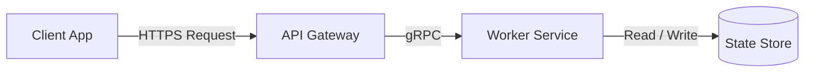

# Writing & Copywriting Frameworks and Templates

This reference guide provides production-ready copywriting frameworks, technical documentation blueprints, and content templates. All examples are universal and stack-agnostic.

---

## Table of Contents
1. [Copywriting Frameworks](#1-copywriting-frameworks)
   - [AIDA (Attention, Interest, Desire, Action)](#aida-framework)
   - [PAS (Problem, Agitate, Solution)](#pas-framework)
   - [BAB (Before, After, Bridge)](#bab-framework)
2. [Technical Documentation Template](#2-technical-documentation-template)
3. [Tutorial Writing Template](#3-tutorial-writing-template)
4. [Product Launch Announcement Template](#4-product-launch-announcement-template)
5. [Changelog Entry Format](#5-changelog-entry-format)
6. [README Template Structure](#6-readme-template-structure)
7. [Blog Post Outline Templates](#7-blog-post-outline-templates)
   - [Template A: The Step-by-Step Technical Guide](#template-a-step-by-step-technical-guide)
   - [Template B: The Architectural Deep-Dive](#template-b-architectural-deep-dive)
   - [Template C: The Technology Comparison / Migration](#template-c-technology-comparison--migration)

---

## 1. Copywriting Frameworks

### AIDA Framework

Use AIDA when introducing new software, writing product landing pages, or crafting announcement emails where you must guide the reader from initial intrigue to decisive action.

| Phase | Purpose | Developer/Tech Translation |
| :--- | :--- | :--- |
| **Attention** | Break pattern, hook curiosity | Surprising benchmark, relatable engineering frustration, or bold capability claim. |
| **Interest** | Validate relevance, present facts | Explain how the mechanism works, supported by technical details or architectural principles. |
| **Desire** | Shift from logic to transformation | Contrast the status quo against the improved state (speed, reliability, happiness, cost). |
| **Action** | Demand a single, clear response | Specific command to run, signup link, or installation step. |

#### AIDA Example 1: Developer CLI Tool Landing Page

> **Attention**:  
> Most distributed builds waste 42% of their CI cycle re-compiling unchanged dependencies.
> 
> **Interest**:  
> Our content-addressable remote build cache tracks file hashes across your entire team. When an engineer or CI runner compiles a target, every other build pulls the verified cached artifact in milliseconds rather than rebuilding from scratch.
> 
> **Desire**:  
> Imagine reducing your pull-request feedback loop from 24 minutes to under 90 seconds. Your engineers stay in flow, merge queues never back up, and your cloud compute bill drops by half.
> 
> **Action**:  
> Add one line to your build script:  
> `curl -fsSL https://get.tool.internal/install.sh | sh`

#### AIDA Example 2: Enterprise API Gateway Launch

> **Attention**:  
> Legacy API gateways force a choice between millisecond latency and fine-grained authorization.
> 
> **Interest**:  
> By executing WebAssembly authorization filters directly in the edge proxy pipeline, our gateway verifies signed cryptographic tokens and evaluates RBAC policies in under 80 microseconds without out-of-process RPC lookups.
> 
> **Desire**:  
> Maintain bank-grade zero-trust compliance on every single HTTP and gRPC request without adding perceptible latency to your customer endpoints.
> 
> **Action**:  
> [Schedule a 15-Minute Architecture Review] or [Read the Edge Benchmarks].

---

### PAS Framework

Use PAS when addressing painful developer bottlenecks, security vulnerabilities, or infrastructure headaches where the cost of inaction is high.

| Phase | Purpose | Developer/Tech Translation |
| :--- | :--- | :--- |
| **Problem** | Identify an exact, recognizable pain | Pinpoint an annoying friction point (e.g., schema drift, flaky tests, log rot). |
| **Agitate** | Quantify the pain and downstream cost | Highlight the compounding stress: midnight alerts, blocked team releases, customer churn. |
| **Solution** | Present the system as the remedy | Show the clean, frictionless path forward. |

#### PAS Example 1: Database Migration & Schema Drift Tool

> **Problem**:  
> Managing database migrations across staging, production, and ephemeral developer environments is prone to silent schema drift and failed deployments.
> 
> **Agitate**:  
> Every manual migration run risks locking tables during peak hours or applying out-of-order patches. A single failed migration can corrupt relational integrity, take down your checkout service, and force engineers into frantic manual rollback scripts at 3:00 AM while customer tickets flood in.
> 
> **Solution**:  
> Our schema engine treats database state as code. It generates reversible, deterministic migration plans, dry-runs them against an ephemeral database clone in CI, and applies zero-downtime online migrations automatically when code merges.  
> Run `schema-cli check --dry-run` to inspect your migrations today.

#### PAS Example 2: Flaky Test Isolation Suite

> **Problem**:  
> Flaky test suites turn green build badges into a lottery.
> 
> **Agitate**:  
> When tests fail intermittently due to race conditions or port contention, developers stop trusting CI. They hit "Re-run failed jobs" three times, burn hours of cloud compute time, and eventually dismiss legitimate regression failures as "just another flake." That is precisely when catastrophic regressions slip into production.
> 
> **Solution**:  
> Automatically quarantine non-deterministic tests on their first failure. Our test runner isolates flaky specs into a quarantined background runner, logs runtime telemetry, and blocks regressions while keeping your main deployment pipeline fast and trustworthy.

---

### BAB Framework

Use BAB for case studies, technology migrations, architectural upgrade proposals, and tool comparisons.

| Phase | Purpose | Developer/Tech Translation |
| :--- | :--- | :--- |
| **Before** | Establish the painful historical reality | Fragile scripts, manual releases, slow feedback loops, fragmented logs. |
| **After** | Describe the transformed future state | Single-command releases, sub-second responses, unified observability, peace of mind. |
| **Bridge** | Detail the bridge that made it possible | The specific tool, pattern, or migration path. |

#### BAB Example: Observability Modernization

> **Before**:  
> Debugging customer issues required searching through three separate logging dashboards, manually correlating microservice request IDs across cloud providers, and guessing which database query caused a 504 gateway timeout. MTTR averaged 4.2 hours.
> 
> **After**:  
> Every request produces a unified distributed trace with correlated logs and span metrics. Engineers pinpoint the offending line of code and slow SQL query in under two minutes from a single timeline view.
> 
> **Bridge**:  
> Migrating to an open-standards OpenTelemetry pipeline with automatic context propagation. By standardizing our telemetry collection and auto-instrumenting our web framework, we achieved full-stack trace correlation in less than two sprint cycles.

---

## 2. Technical Documentation Template

Use this template when authoring formal system documentation, reference guides, or architectural specifications.

```markdown
# [Module / System Name]

Short summary (1–2 sentences) defining what this component is, what system role it plays, and its primary interfaces.

---

## Architecture Overview

Brief conceptual explanation of how this component functions. Include a Mermaid diagram or flow chart illustrating data flow or interaction boundaries.



### Key Capabilities
- **Reliable processing**: Exactly-once message semantics via idempotency keys.
- **Low latency**: In-memory caching with asynchronous disk persistence.
- **Observability**: Prometheus metrics and OpenTelemetry trace headers emitted by default.

---

## Prerequisites

Before configuring or running this component, ensure you have:
- Runtime environment: [e.g., Node.js >= 20.0.0 / Go >= 1.22 / Python >= 3.11]
- Access credentials or tokens with appropriate scopes
- Network access to: `api.domain.internal:443`

---

## Quickstart

Run the component locally in under two minutes:

```bash
# 1. Install dependencies or pull container
docker pull registry.internal/service-name:latest

# 2. Set minimum required environment variables
export SERVICE_PORT=8080
export LOG_LEVEL=info

# 3. Start the process
docker run -p 8080:8080 -e SERVICE_PORT -e LOG_LEVEL registry.internal/service-name:latest
```

Verify the service is active:
```bash
curl http://localhost:8080/healthz
# Expected output: {"status":"healthy","uptime_seconds":12}
```

---

## Configuration Reference

The service is configured via environment variables or a YAML configuration file.

| Variable | Type | Default | Description |
| :--- | :--- | :--- | :--- |
| `SERVICE_PORT` | Integer | `8080` | Port on which the HTTP server listens |
| `MAX_CONNECTIONS` | Integer | `1000` | Maximum concurrent TCP client connections |
| `ENABLE_METRICS` | Boolean | `true` | Exposes Prometheus metrics on `/metrics` |
| `DATABASE_URL` | String | *(Required)* | Full connection string for PostgreSQL database |

---

## API Reference / Core Methods

### `ProcessPayload(ctx, payload)`

Dispatches a batch payload for asynchronous transformation and storage.

#### Parameters
- `ctx` (`context.Context`): Standard execution context with deadline and cancellation.
- `payload` (`BatchRequest`): Struct containing:
  - `ID` (`string`, required): Unique transaction identifier.
  - `Records` (`[]Record`, required): Array of 1 to 500 data records.

#### Return Values
- `Response` (`*BatchResult`): Summary including processed record count and status.
- `Error` (`error`): Returns `ErrInvalidPayload` or `ErrDatabaseUnavailable`.

#### Example Usage
```go
req := BatchRequest{
    ID: "batch-1092",
    Records: records,
}
result, err := client.ProcessPayload(ctx, req)
if err != nil {
    log.Fatalf("Failed to process batch: %v", err)
}
fmt.Printf("Batch committed: %d records\n", result.Count)
```

---

## Operational Procedures & Troubleshooting

### Common Error Codes

| Error Code | Root Cause | Resolution |
| :--- | :--- | :--- |
| `ERR_AUTH_EXPIRED` | API token has passed its TTL | Rotate secret using `auth-cli token refresh` |
| `ERR_RATE_LIMITED` | Exceeded 5,000 req/sec limit | Implement exponential backoff with jitter |
| `ERR_STORAGE_TIMEOUT` | Database write queue saturated | Increase worker pool size via `MAX_WORKERS` |

### Health Checks & Diagnostics
- Liveness probe: `GET /livez` (returns `200 OK` if process is executing)
- Readiness probe: `GET /readyz` (returns `200 OK` if database connections are warm)
```

---

## 3. Tutorial Writing Template

Use this template for step-by-step developer guides, "getting started" manuals, and how-to articles.

```markdown
# How to [Build / Implement X] with [Technology Y]

Learn how to [accomplish goal] in under [X] minutes. By the end of this guide, you will have a working [target project] deployed and handling [functional requirement].

- **Time to Complete**: 15 minutes
- **Skill Level**: Intermediate
- **Stack**: [Language / Framework / Database]

---

## Prerequisites

Before starting, make sure you have:
- [Language / Tool] installed (`vX.Y.Z` or newer)
- A terminal with standard Unix utilities (`curl`, `git`)
- A text editor or IDE configured

Check your environment:
```bash
node --version # Should return v20.x or higher
```

---

## Step 1: Initialize the Project

First, create a clean workspace directory and set up the foundation:

```bash
mkdir modern-service && cd modern-service
npm init -y
npm install express dotenv
```

**Why this matters**: This establishes our application entry point and installs the minimal dependencies without unnecessary bloat.

---

## Step 2: Implement the Core Controller

Create `server.js` and add the basic router configuration:

```javascript
import express from 'express';

const app = express();
app.use(express.json());

app.get('/api/items', (req, res) => {
  res.json({ status: 'ok', data: [] });
});

const PORT = process.env.PORT || 3000;
app.listen(PORT, () => {
  console.log(`Server listening on port ${PORT}`);
});
```

---

## Step 3: Verify Your Progress

Start the development server and test the endpoint:

```bash
node server.js
```

In a separate terminal tab, send a request:
```bash
curl -i http://localhost:3000/api/items
```

**Expected Output**:
```http
HTTP/1.1 200 OK
Content-Type: application/json; charset=utf-8

{"status":"ok","data":[]}
```

> [!TIP]
> If you receive `ECONNREFUSED`, verify that another process is not already occupying port 3000 by running `lsof -i :3000`.

---

## Step 4: Add Error Handling & Graceful Shutdown

Production services must clean up connections when terminated:

```javascript
process.on('SIGTERM', () => {
  console.log('SIGTERM signal received: closing HTTP server');
  server.close(() => {
    console.log('HTTP server closed');
  });
});
```

---

## Summary & Next Steps

You have successfully built, tested, and verified a production-ready baseline service.

### What you learned:
- How to scaffold the service with minimal dependencies.
- How to structure JSON routes.
- How to handle graceful termination signals.

### Next Steps:
- [Add Authentication with JWT Tokens](#)
- [Connect a PostgreSQL Database with Connection Pooling](#)
- [Deploy the Service via Docker and Kubernetes](#)
```

---

## 4. Product Launch Announcement Template

Use this format for major version releases, new product offerings, and launch blog posts.

```markdown
# Introducing [Product Name]: [One-Sentence Value Proposition]

Today, we are announcing the general availability of **[Product Name]**—a [category/descriptor] designed to [solve core pain point] without [common frustration].

[Include hero image / terminal GIF / architecture diagram here]

---

## The Problem: Why We Built This

Over the past decade, [describe industry standard approach]. While this worked for small setups, modern development teams struggle with:
- **Pain Point 1**: Slow iteration loops caused by [cause].
- **Pain Point 2**: Brittle configurations requiring specialized operational knowledge.
- **Pain Point 3**: Ballooning infrastructure costs as traffic scales.

Engineers spend more time fighting their tooling than writing business features. We built **[Product Name]** to solve this once and for all.

---

## Key Capabilities

### 1. [Capability One: e.g., Sub-Millisecond Cold Starts]
Explain the technical breakthrough and practical benefit.
- *Under the hood*: Leverages lightweight V8 isolates rather than full container virtualization.
- *What you experience*: Instant startup times, zero idle memory consumption.

### 2. [Capability Two: e.g., Declarative Zero-Config Routing]
Explain how this simplifies day-to-day workflow.
```typescript
// Define routes and validation in one place
export const route = defineRoute({
  path: '/users/:id',
  schema: UserQuerySchema,
  handler: async (ctx) => { /* ... */ }
});
```

### 3. [Capability Three: e.g., Native OpenTelemetry Observability]
Tracing, metrics, and logs out of the box with zero external agents required.

---

## Real-World Impact

> "[Product Name] allowed our engineering organization to reduce deploy times by 68% while eliminating 99% of our staging environment drift."  
> — **Lead Infrastructure Architect, High-Scale SaaS**

---

## Getting Started in 60 Seconds

You can start using **[Product Name]** immediately. No credit card or complex cluster setup required:

```bash
# Install the CLI
npm install -g @product/cli

# Initialize a project
product init my-app
cd my-app && product dev
```

Visit `http://localhost:4000` to see your local dashboard.

---

## What’s Next & Availability

[Product Name] is available starting today under the [Open Source License / Tiered Plans].

- Read the [Documentation](https://docs.domain.internal)
- Join our [Developer Community](https://community.domain.internal)
- Star the repository on [GitHub](https://github.com/org/repo)
```

---

## 5. Changelog Entry Format

Follow [Keep a Changelog](https://keepachangelog.com/) with Semantic Versioning (`MAJOR.MINOR.PATCH`).

```markdown
# Changelog

All notable changes to this project will be documented in this file.

The format is based on [Keep a Changelog](https://keepachangelog.com/en/1.1.0/),
and this project adheres to [Semantic Versioning](https://semver.org/spec/v2.0.0.html).

---

## [Unreleased]

### Added
- Experimental support for HTTP/3 and QUIC transport protocol.

---

## [2.4.0] - 2026-10-06

### Breaking Changes ⚠️
- `Config.Timeout` is now parsed as a `time.Duration` string (e.g., `"5s"`) instead of an integer number of seconds.

### Added
- Added `--dry-run` flag to the CLI command `migrate apply` to preview SQL transactions without executing them.
- Support for AWS IAM database authentication tokens.

### Changed
- Default connection pool size increased from 10 to 25 connections for high-concurrency environments.
- Updated base Alpine Docker image to `3.20` to address upstream vulnerabilities.

### Deprecated
- `Client.ExecuteLegacyQuery()` is deprecated and will be removed in version `3.0.0`. Use `Client.Query()` instead.

### Removed
- Removed legacy TLS 1.0 and 1.1 protocol negotiation. Only TLS 1.2 and 1.3 are supported.

### Fixed
- Fixed race condition where concurrent read locks on the routing table caused occasional panics during hot reloads (#412).
- Resolved memory leak in WebSocket client session disconnection handler (#428).

### Security
- Patched CVE-2026-XXXX by upgrading the internal YAML parser library to `v2.1.4`.
```

### Comparison: Good vs. Bad Changelog Entries

| Anti-Pattern (Vague, Developer Commit Dumps) | Best Practice (User-Focused, Informative) |
| :--- | :--- |
| `Fix bugs in auth` | `Fixed issue where expired JWT tokens returned 500 Internal Server Error instead of 401 Unauthorized.` |
| `Update dependencies` | `Upgraded OpenSSL to 3.3.0 to patch security advisory CVE-2026-1029.` |
| `Refactor router` | `Changed internal router to use a radix tree, improving path matching throughput by 35%.` |
| `Misc fixes` | *(Never use misc fixes. List exact bug fixes or omit the line entirely.)* |

---

## 6. README Template Structure

Use this template as the standard blueprint for open-source repositories and internal libraries.

```markdown
<div align="center">

# Project Name

**A fast, deterministic [tool/library category] for modern [ecosystem/stack].**

[](https://github.com/org/repo/actions)
[](https://github.com/org/repo/releases)
[](LICENSE)
[](https://codecov.io)

[Read the Docs](https://docs.domain.internal) · [Report Bug](https://github.com/org/repo/issues) · [Request Feature](https://github.com/org/repo/issues)

</div>

---

## Highlights

- ⚡ **High Throughput**: Handles over 150,000 operations per second with zero memory allocations in hot paths.
- 🛡️ **Type-Safe**: Full TypeScript / static type definitions generated directly from schemas.
- 🔌 **Drop-in Compatible**: Compatible with standard [Ecosystem] configurations without rewrites.
- 📦 **Lightweight**: Zero third-party runtime dependencies.

---

## Quickstart

### 1. Installation

Install via your preferred package manager:

```bash
npm install project-name
# or
cargo add project-name
# or
go get github.com/org/project-name
```

### 2. Basic Usage

```typescript
import { createEngine } from 'project-name';

const engine = createEngine({
  concurrency: 4,
  timeoutMs: 5000,
});

const result = await engine.execute({
  query: 'SELECT * FROM users WHERE active = true',
});

console.log(result.rows);
```

---

## Architecture

```
┌──────────────┐      ┌───────────────┐      ┌──────────────┐
│  Client App  │ ───> │  Task Engine  │ ───> │ Worker Pool  │
└──────────────┘      └───────────────┘      └──────────────┘
                             │
                             ▼
                      ┌───────────────┐
                      │ Storage Cache │
                      └───────────────┘
```

The system executes tasks in a non-blocking event loop backed by an in-process ring buffer. For a deeper architectural breakdown, see [ARCHITECTURE.md](docs/ARCHITECTURE.md).

---

## Configuration

Pass configuration options to the initialization call or define them in `config.json`:

| Option | Type | Default | Description |
| :--- | :--- | :--- | :--- |
| `concurrency` | `number` | `os.cpus().length` | Maximum worker threads |
| `debug` | `boolean` | `false` | Enables verbose structured logging |
| `retryLimit` | `number` | `3` | Number of automated attempts on network failure |

---

## Benchmarks

Run benchmarks locally:
```bash
npm run benchmark
```

| Engine | Latency (p50) | Latency (p99) | Memory Usage |
| :--- | :--- | :--- | :--- |
| **Project Name** | **0.8 ms** | **2.1 ms** | **38 MB** |
| Competitor A | 3.4 ms | 12.8 ms | 142 MB |
| Competitor B | 2.1 ms | 8.4 ms | 94 MB |

---

## Contributing

Contributions make open source an incredible place to learn, inspire, and create. Any contributions you make are **greatly appreciated**.

1. Fork the Project
2. Create your Feature Branch (`git checkout -b feature/AmazingFeature`)
3. Commit your Changes (`git commit -m 'feat: Add some AmazingFeature'`)
4. Push to the Branch (`git push origin feature/AmazingFeature`)
5. Open a Pull Request

Please review our [Contributing Guide](CONTRIBUTING.md) and [Code of Conduct](CODE_OF_CONDUCT.md).

---

## License

Distributed under the MIT License. See [LICENSE](LICENSE) for more information.
```

---

## 7. Blog Post Outline Templates

### Template A: Step-by-Step Technical Guide

```markdown
# Title: How to [Solve Problem / Build Feature] in [Framework] (Step-by-Step)

## 1. Introduction & The Hook
- The core challenge: Why is this problem frustrating or common?
- The outcome: What will the reader have built or mastered by the end?
- Time / skill investment and prerequisites.

## 2. Theoretical Context (Keep Brief: 2-3 paragraphs max)
- Why the standard approach falls short.
- The architectural mental model needed before coding.

## 3. Step 1: Baseline Setup
- Initial command line scaffolding.
- Minimal dependencies.
- Verification command.

## 4. Step 2: Implementing the Core Mechanism
- Clean, annotated code block.
- Explanation of key lines (avoid explaining obvious boilerplate).

## 5. Step 3: Handling Edge Cases & Failures
- Error handling, timeouts, or race conditions.
- How to test edge cases reliably.

## 6. Step 4: Verification & Testing
- How the reader can confirm everything works.
- Example terminal output.

## 7. Production Hardening Checklist
- Security checks, caching recommendations, environment variable hygiene.

## 8. Conclusion & Next Steps
- Summary of what was accomplished.
- Single Call to Action (CTA): Link to GitHub repo, related tutorial, or newsletter.
```

---

### Template B: Architectural Deep-Dive

```markdown
# Title: Under the Hood: How We Built [System] to Handle [X Benchmark]

## 1. The Opening Hook: The Bottleneck
- The scale metric: "When traffic hit 50k RPS, our connection pool broke."
- The stakes: Downtime, cloud bills, user experience.

## 2. Why Obvious Solutions Failed
- Solution 1 (e.g., Scaling vertically): Why it was cost-prohibitive.
- Solution 2 (e.g., Simple caching): Why cache invalidation caused stale state.

## 3. The New Architecture: Core Principles
- High-level design diagram (Mermaid).
- Key design decisions: Why we chose X over Y (e.g., Rust vs. Go, Raft vs. Paxos).

## 4. Deep-Dive: The Tricky Part
- The hardest bug or synchronization challenge encountered during development.
- The breakthrough: Code snippet or algorithm explanation.

## 5. Benchmark Results & Real-World Metrics
- Visual charts or Markdown comparison table.
- Latency (p50, p99), CPU utilization, and operational cost savings.

## 6. Key Takeaways for Other Engineering Teams
- 3 generalized lessons other developers can apply to their own systems.

## 7. Discussion / CTA
- "How does your team handle [problem]? Join the conversation on [Discussions / Twitter]."
```

---

### Template C: Technology Comparison / Migration

```markdown
# Title: [Technology A] vs. [Technology B]: Which One Should You Pick in [Current Year]?

## 1. Introduction: The False Dilemma
- Why developers are currently debating between A and B.
- Thesis: Neither is universally better; the right choice depends on your specific constraints.

## 2. Summary Comparison Matrix
- Quick-glance table covering: Performance, Learning Curve, Ecosystem, Maintenance Cost, Ideal Use Case.

## 3. Deep-Dive: Technology A
- Core philosophy and strengths.
- Where it excels (with code snippet).
- Where it breaks down or frustrates developers.

## 4. Deep-Dive: Technology B
- Core philosophy and strengths.
- Where it excels (with code snippet).
- Where it breaks down or frustrates developers.

## 5. Direct Head-to-Head Tests
- Benchmark 1: Developer velocity & setup time.
- Benchmark 2: Runtime performance and memory footprint.
- Benchmark 3: Long-term operational overhead.

## 6. The Decision Framework: Which Should You Choose?
- Choose [Technology A] if: [3 clear bullet criteria].
- Choose [Technology B] if: [3 clear bullet criteria].

## 7. Conclusion & Next Steps
- How to trial or migrate without complete system rewrites.
- Link to starter templates for both options.
```
